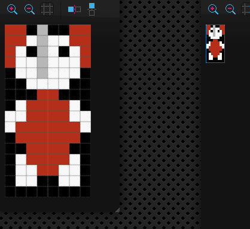
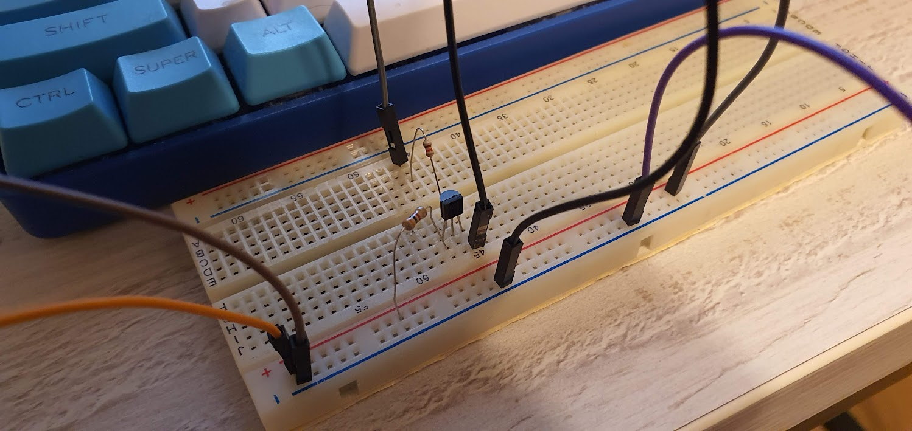

# 2024-03-01 - Day #001

A friend convinced me to take part in the [100 Commits](https://100commitow.pl/) competition. Since few months I wanted to write something for Atari 2600. I thought that the competition could be good occassion to have some fun and learn something completely new. So I decided to write a game for the Atari as a part of the competition. I have an idea for the game, but I won't reveal it yet.

I started preparations few weeks ago. I install tools and configure the environment. I started reading books:

1. Nick Montfort, Ian Bogost - [Racing the Beam](https://mitpress.mit.edu/9780262539760/racing-the-beam/) - it contains Atari 2600 platform analysis and also analysis of some famous games, from the developer's point of view.
2. Jan Ruszczyc - [Asembler 6502](https://retronics.eu/?a=item&id=20&l=pl) - how to use 6502 assembler. Although Atari 2600 contains 6507 processor, but it is stripped down version of 6502, so the knowledge won't be wasted.

I almost failed on the first day. Contest's rules says at least one commit by the repo author is needed. I had a wrong email address in my git configuration, so my previous commits were accounted to the different Github users! Fortunately, I noticed it.

# 2024-03-02 - Day #002

I spent night reading Batari Basic documentation and "kernels" descriptions here: [https://www.randomterrain.com/atari-2600-memories-batari-basic-commands.html](https://www.randomterrain.com/atari-2600-memories-batari-basic-commands.html)

It looks like that limitations are everywhere. I started to think how to workaround them, for example, how to make a bigger player sprite.

Few examples of limitations:

1. Atari 2600 has 128 bytes of RAM, but only 26 of them are available. Other are already used for different purposes.
2. You can draw only a few moveable objects: 2 player sprintes, 2 missiles (which are always square) and one ball.
3. If you want your sprite to have more than one color, you cannot use missile.
4. There is no simple way to print text (so I can't even start with "hello world!" program).
5. Binary program should be 4KB at most. If you want more, you can use bankswitching, but Atari has access to only one 4KB bank at one moment.

I started working on the cartridge PCB. Why, if I have no single line of the game so far? It's because I want to order the boards as soon as possible. They will arrive within 30 days or so. If I made a mistake, I want to have time to fix it.

However, I did more complicated cartridges before - for example [128-in-1 cartridge clone](https://youtu.be/PjKU597y_PI). I'm pretty convinced that my design of the simple 4KB cart will work too. You can find similiar designs here and there, for example: [https://grandideastudio.com/portfolio/gaming/pixels-past/](https://grandideastudio.com/portfolio/gaming/pixels-past/).

While it's simple, elegant and battle-tested, I want to simplify it even more. Currently I'm using a 74S04 inverter and I'm using only one of its 6 gates. I don't need a integrated circuit to invert one bit and I'm going to replace it with inverter made from transistor and two resistors.

# 2024-03-03 - Dzień #003

Today I played a little bit with sprite editor and created preliminary version of player sprite. Please, welcome Berta!

I'm not sure if I would be able to use it because of the used colors.

I also checked if the inverter made from transistor and two resistor works as it should. Yes, it works!

