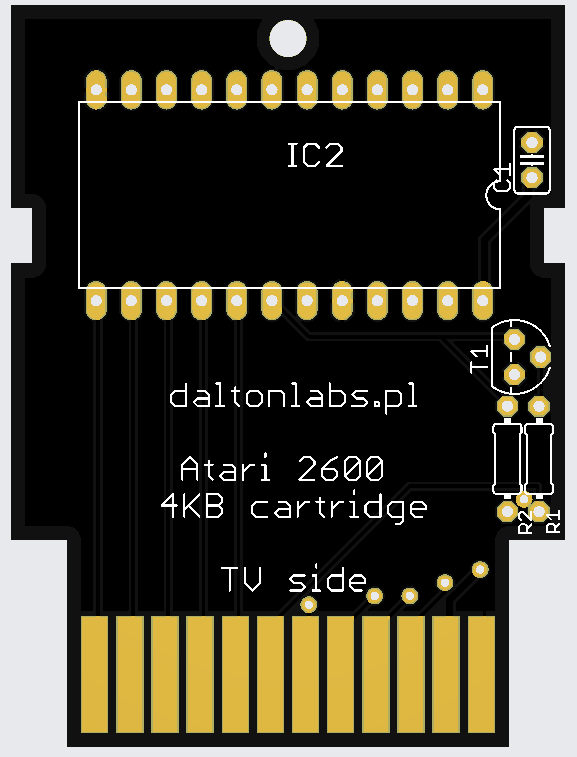
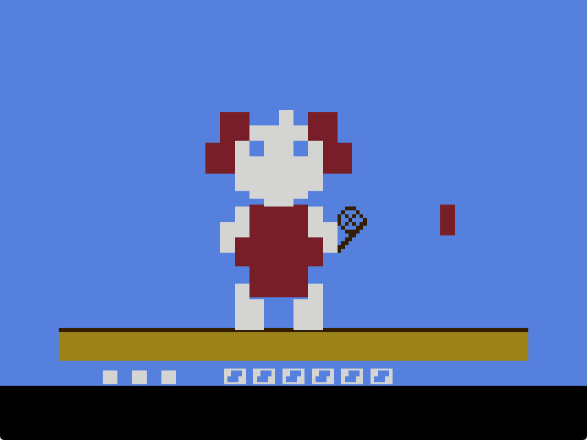

# 2024-03-01 - Day #001

A friend convinced me to take part in the [100 Commits](https://100commitow.pl/) competition. Since few months I wanted to write something for Atari 2600. I thought that the competition could be good occassion to have some fun and learn something completely new. So I decided to write a game for the Atari as a part of the competition. I have an idea for the game, but I won't reveal it yet.

I started preparations few weeks ago. I install tools and configure the environment. I started reading books:

1. Nick Montfort, Ian Bogost - [Racing the Beam](https://mitpress.mit.edu/9780262539760/racing-the-beam/) - it contains Atari 2600 platform analysis and also analysis of some famous games, from the developer's point of view.
2. Jan Ruszczyc - [Asembler 6502](https://retronics.eu/?a=item&id=20&l=pl) - how to use 6502 assembler. Although Atari 2600 contains 6507 processor, but it is stripped down version of 6502, so the knowledge won't be wasted.

I almost failed on the first day. Contest's rules says at least one commit by the repo author is needed. I had a wrong email address in my git configuration, so my previous commits were accounted to the different Github users! Fortunately, I noticed it.

# 2024-03-02 - Day #002

I spent night reading Batari Basic documentation and "kernels" descriptions here: [https://www.randomterrain.com/atari-2600-memories-batari-basic-commands.html](https://www.randomterrain.com/atari-2600-memories-batari-basic-commands.html)

It looks like that limitations are everywhere. I started to think how to workaround them, for example, how to make a bigger player sprite.

Few examples of limitations:

1. Atari 2600 has 128 bytes of RAM, but only 26 of them are available. Other are already used for different purposes.
2. You can draw only a few moveable objects: 2 player sprites, 2 missiles (which are always square) and one ball.
3. If you want your sprite to have more than one color, you cannot use missile.
4. There is no simple way to print text (so I can't even start with "hello world!" program).
5. Binary program should be 4KB at most. If you want more, you can use bankswitching, but Atari has access to only one 4KB bank at one moment.

I started working on the cartridge PCB. Why, if I have no single line of the game so far? It's because I want to order the boards as soon as possible. They will arrive within 30 days or so. If I made a mistake, I want to have time to fix it.

However, I did more complicated cartridges before - for example [128-in-1 cartridge clone](https://youtu.be/PjKU597y_PI). I'm pretty convinced that my design of the simple 4KB cart will work too. You can find similiar designs here and there, for example: [https://grandideastudio.com/portfolio/gaming/pixels-past/](https://grandideastudio.com/portfolio/gaming/pixels-past/).

While it's simple, elegant and battle-tested, I want to simplify it even more. Currently I'm using a 74S04 inverter and I'm using only one of its 6 gates. I don't need a integrated circuit to invert one bit and I'm going to replace it with inverter made from transistor and two resistors.

# 2024-03-03 - Day #003

Today I played a little bit with sprite editor and created preliminary version of player sprite. Please, welcome Berta!

I'm not sure if I would be able to use it because of the used colors.

I also checked if the inverter made from transistor and two resistor works as it should. Yes, it works!

# 2024-03-04 - Day #004

OK, so I replaced the inverter IC with transistor based inverter on the board design and I ordered PCBs.

# 2024-03-05 - Day #005

Today I experimented with sprites. And I revealed the idea for the game :)
I displayed some sprites. Because the game is quite static, I don't need to animate the sprites. I want the game to be colorful (such games appeal to me more than these with black background), so I tried to combine sprite with playground to display big Berta:

It's far from perfect, but I'm pretty convinced that I'll be able to display what I want.

# 2024-03-06 - Day #006

I deceided to use more traditional way when comes to the game visual design. I'm drawing sprites and playfield by hand, using pencil. Ok, I'm using reMarkable tablet, not a real paper, so let's say it's a semi-traditional way ;)

I already know that I need to combine playfield with sprite, to create a multi-color, big character. The main difficulty is that "playfield pixels" are rectangular, while "sprite pixels" are square and sometimes it is hard to achieve desired effect. Here Berta's neck is too long, but I cannot make it smaller, because I cannot split "playfield pixel":

Now when I see other game for the Atari 2600, I'm automatically thinking how it was done. For example, [Combat](https://youtu.be/3m86ftny1uY) game is an example of how to use console's abilities in the most direct way: display two sprites and two missiles, and a playfield. [Breakout](https://youtu.be/tT70Tv6D41o) apparently has one sprite for paddle, the ball and bricks made out of the "playfield pixels".

# 2024-03-07 - Day #007

I carried on with manual designing. I also coded the sprite and the playfield to display Berta in appropriate form for the first time!

# 2024-03-08 - Day #008

Today I take a break :)
I can show you a render of PCB, which is in production already:

Ok, I did some experiments with joystick handling.

# 2024-03-09 - Day #009

I added second sprite - for butterfly net. It's the last sprite I can use :)

I started thinking about joystick control. On the original G&W console only one button press is needed to move the character to the given position (top-left, top-right, bottom-left, bottom right). On Atari you'll need two joystick moves sometimes - for example, to move Berta from bottom left to the top right, you need to move joystick to the right and to the top. A different gamepad, like from Playstation or Xbox would be better. I could use top and bottom arrows and triangle and cross keys. Maybe I'll make a special adapter for this game (or even the special controller).

# 2024-03-10 - Day #010

I changed the butterfly net sprite for more "realistic" :) After the first experiments with joystick now Berta moves with it. I used REFP0 and REFP1 registers, to display mirrored sprites depending on Berta's position - if she is moved left or right. Thanks to that I saved some memory in ROM, because I don't need to keep two variants of each sprite.

| Berta in top-left position| Berta in bottom-down position|
|----------------|---------------|
|||

# 2024-03-11 - Day #011

I made butterfly net sprite twice as wide as it was. I started experiments with sounds, but I have nothing to commit yet...

I also added an experimental version of butterfly "animation". Butterflies are made of "playfield pixels" and their modification is quite expensive when comes to the processor cycles. I will probably run out of cycles when I display four or five butterflies at the same time.

# 2024-03-12 - Day #012

It's time to start thinking about the gameplay algorithm. I want to create a similiar experience to the original, but not identical. For example - I won't make the clock, neither the alarm. I also remember that a rooster appeared sometimes in the original game and you could lose only half of live while it's visible. I don't have a place on the screen for "rooster", so I'm going to give up on it.

The original G&W console used Sharp SM-5A microprocessor, while the russian consoles used its clone - КБ1013ВК1-2. Milan Galcik created a disassembler for this processor and did a reverse-engineer of the "Egg" game algorithm: [Sharp SM-5A Disassembler](https://www.septimus.sk/KB1013dbg/index.html). I really admire his work. Although I don't want to implement 1:1 game equivalent, his description will be helpful.
