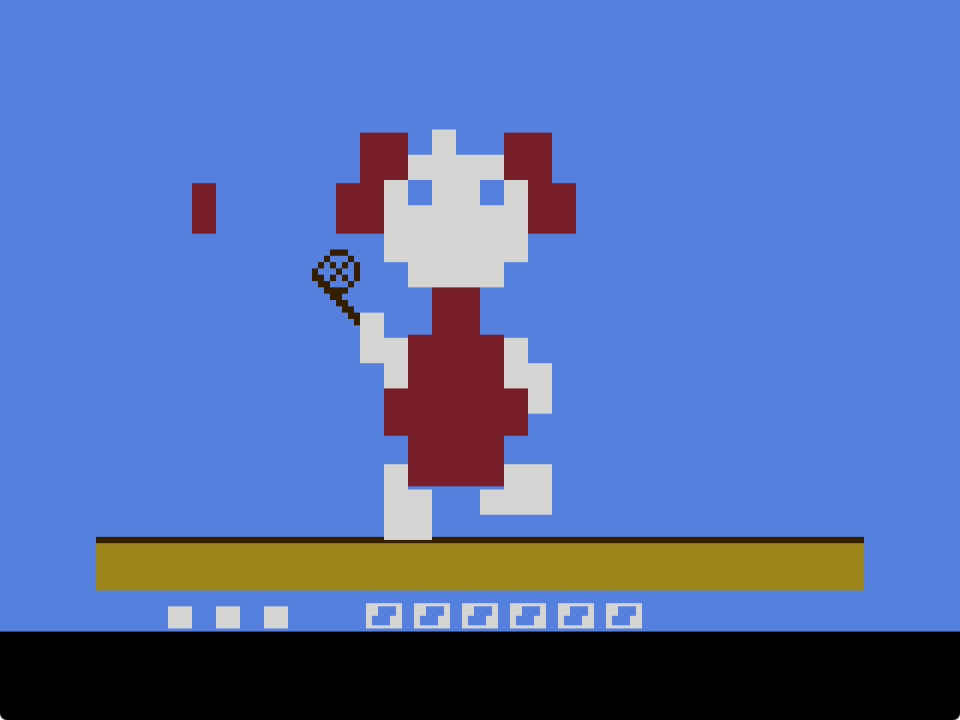
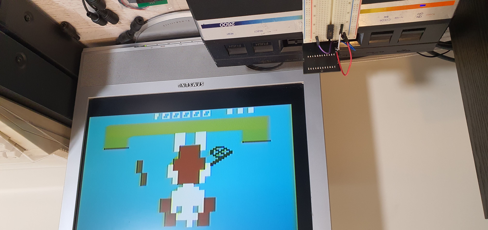
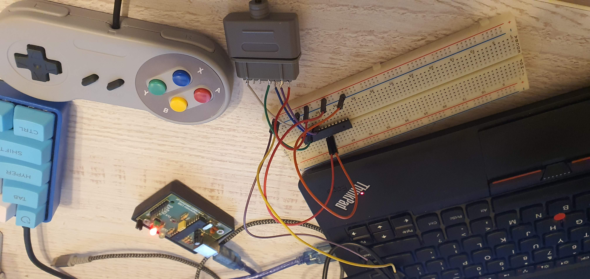
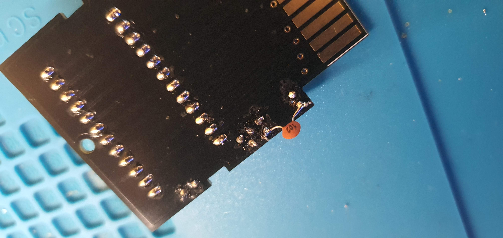
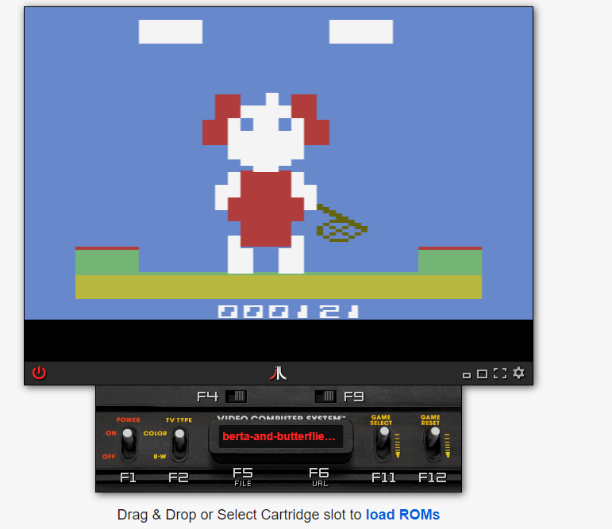
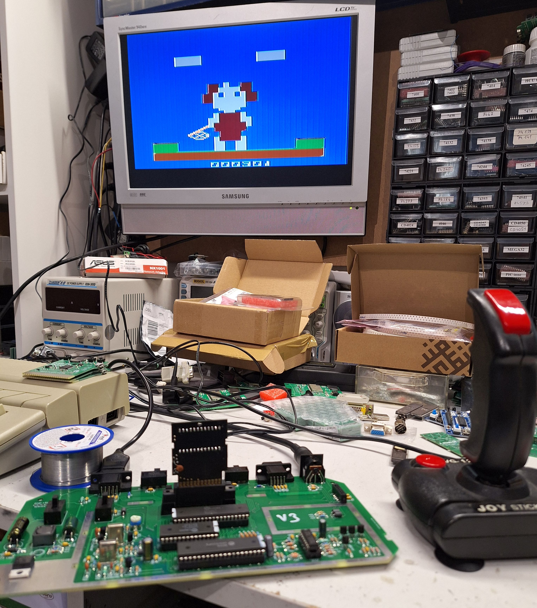
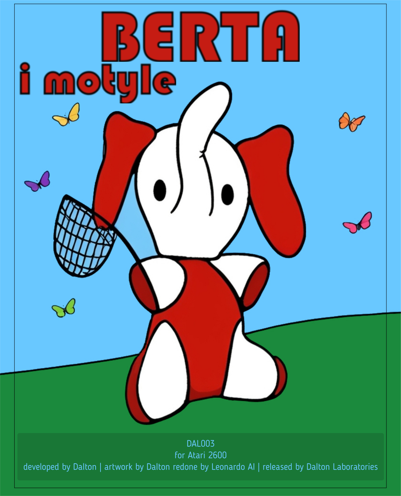

# 2024-03-01 - Day #001

A friend convinced me to take part in the [100 Commits](https://100commitow.pl/) competition. Since few months I wanted to write something for Atari 2600. I thought that the competition could be good occassion to have some fun and learn something completely new. So I decided to write a game for the Atari as a part of the competition. I have an idea for the game, but I won't reveal it yet.

I started preparations few weeks ago. I install tools and configure the environment. I started reading books:

1. Nick Montfort, Ian Bogost - [Racing the Beam](https://mitpress.mit.edu/9780262539760/racing-the-beam/) - it contains Atari 2600 platform analysis and also analysis of some famous games, from the developer's point of view.
1. Jan Ruszczyc - [Asembler 6502](https://retronics.eu/?a=item&id=20&l=pl) - how to use 6502 assembler. Although Atari 2600 contains 6507 processor, but it is stripped down version of 6502, so the knowledge won't be wasted.

I almost failed on the first day. Contest's rules says at least one commit by the repo author is needed. I had a wrong email address in my git configuration, so my previous commits were accounted to the different Github users! Fortunately, I noticed it.

# 2024-03-02 - Day #002

I spent night reading Batari Basic documentation and "kernels" descriptions here: [https://www.randomterrain.com/atari-2600-memories-batari-basic-commands.html](https://www.randomterrain.com/atari-2600-memories-batari-basic-commands.html)

It looks like that limitations are everywhere. I started to think how to workaround them, for example, how to make a bigger player sprite.

Few examples of limitations:

1. Atari 2600 has 128 bytes of RAM, but only 26 of them are available. Other are already used for different purposes.
1. You can draw only a few moveable objects: 2 player sprites, 2 missiles (which are always square) and one ball.
1. If you want your sprite to have more than one color, you cannot use missile.
1. There is no simple way to print text (so I can't even start with "hello world!" program).
1. Binary program should be 4KB at most. If you want more, you can use bankswitching, but Atari has access to only one 4KB bank at one moment.

I started working on the cartridge PCB. Why, if I have no single line of the game so far? It's because I want to order the boards as soon as possible. They will arrive within 30 days or so. If I made a mistake, I want to have time to fix it.

However, I did more complicated cartridges before - for example [128-in-1 cartridge clone](https://youtu.be/PjKU597y_PI). I'm pretty convinced that my design of the simple 4KB cart will work too. You can find similiar designs here and there, for example: [https://grandideastudio.com/portfolio/gaming/pixels-past/](https://grandideastudio.com/portfolio/gaming/pixels-past/).

While it's simple, elegant and battle-tested, I want to simplify it even more. Currently I'm using a 74S04 inverter and I'm using only one of its 6 gates. I don't need a integrated circuit to invert one bit and I'm going to replace it with inverter made from transistor and two resistors.

# 2024-03-03 - Day #003

Today I played a little bit with sprite editor and created preliminary version of player sprite. Please, welcome Berta!

I'm not sure if I would be able to use it because of the used colors.

I also checked if the inverter made from transistor and two resistor works as it should. Yes, it works!

# 2024-03-04 - Day #004

OK, so I replaced the inverter IC with transistor based inverter on the board design and I ordered PCBs.

# 2024-03-05 - Day #005

Today I experimented with sprites. And I revealed the idea for the game :)
I displayed some sprites. Because the game is quite static, I don't need to animate the sprites. I want the game to be colorful (such games appeal to me more than these with black background), so I tried to combine sprite with playground to display big Berta:

It's far from perfect, but I'm pretty convinced that I'll be able to display what I want.

# 2024-03-06 - Day #006

I deceided to use more traditional way when comes to the game visual design. I'm drawing sprites and playfield by hand, using pencil. Ok, I'm using reMarkable tablet, not a real paper, so let's say it's a semi-traditional way ;)

I already know that I need to combine playfield with sprite, to create a multi-color, big character. The main difficulty is that "playfield pixels" are rectangular, while "sprite pixels" are square and sometimes it is hard to achieve desired effect. Here Berta's neck is too long, but I cannot make it smaller, because I cannot split "playfield pixel":

Now when I see other game for the Atari 2600, I'm automatically thinking how it was done. For example, [Combat](https://youtu.be/3m86ftny1uY) game is a presentation of how to use console's abilities in the most direct way: display two sprites and two missiles, and a playfield. [Breakout](https://youtu.be/tT70Tv6D41o) apparently has one sprite for paddle, the ball and bricks made out of the "playfield pixels".

# 2024-03-07 - Day #007

I carried on with manual designing. I also coded the sprite and the playfield to display Berta in appropriate form for the first time!

# 2024-03-08 - Day #008

Today I take a break :)
I can show you a render of PCB, which is in production already:

Ok, I did some experiments with joystick handling.

# 2024-03-09 - Day #009

I added second sprite - for butterfly net. It's the last sprite I can use :)

I started thinking about joystick control. On the original G&W console only one button press is needed to move the character to the given position (top-left, top-right, bottom-left, bottom right). On Atari you'll need two joystick moves sometimes - for example, to move Berta from bottom left to the top right, you need to move joystick to the right and to the top. A different gamepad, like from Playstation or Xbox would be better. I could use top and bottom arrows and triangle and cross keys. Maybe I'll make a special adapter for this game (or even the special controller).

# 2024-03-10 - Day #010

I changed the butterfly net sprite for more "realistic" :) After the first experiments with joystick now Berta moves with it. I used REFP0 and REFP1 registers, to display mirrored sprites depending on Berta's position - if she is moved left or right. Thanks to that I saved some memory in ROM, because I don't need to keep two variants of each sprite.

| Berta in top-left position| Berta in bottom-down position|
|----------------|---------------|
|||

# 2024-03-11 - Day #011

I made butterfly net sprite twice as wide as it was. I started experiments with sounds, but I have nothing to commit yet...

I also added an experimental version of butterfly "animation". Butterflies are made of "playfield pixels" and their modification is quite expensive when comes to the processor cycles. I will probably run out of cycles when I display four or five butterflies at the same time.

# 2024-03-12 - Day #012

It's time to start thinking about the gameplay algorithm. I want to create a similiar experience to the original, but not identical. For example - I won't make the clock, neither the alarm. I also remember that a rooster appeared sometimes in the original game and you could lose only half of live while it's visible. I don't have a place on the screen for "rooster", so I'm going to give up on it.

The original G&W console used Sharp SM-5A microprocessor, while the russian consoles used its clone - КБ1013ВК1-2. Milan Galcik created a disassembler for this processor and did a reverse-engineer of the "Egg" game algorithm: [Sharp SM-5A Disassembler](https://www.septimus.sk/KB1013dbg/index.html). I really admire his work. Although I don't want to implement 1:1 game equivalent, his description will be helpful.

# 2024-03-13 - Day #013

Today I added a sound to the butterfly "animation", which is quite ok for my ears. I didn't mentioned it yet, but Atari 2600's sound capabilities are also very limited. (However, the real artist can do miracles with it - check this cTrix performance: [https://youtu.be/S8e7g8kJIlo](https://youtu.be/S8e7g8kJIlo)).

I want to immerse in the original game, to know it as much as possible. Unfortunetely, neither of my vintage consoles work, but what are emulators for?

# 2024-03-14 - Day #014

I added all missing butterflies. Butterflies are made of "playground pixels". Their higlighting is expensive when comes to the processor cycles. So far they are animated correctly, but there will be even more butterflies flying - up to 12 at the same time! I quess it will be too much. So I'll probably change the method of higlighting playground pixels to more direct, assembler-like way.

I also added some bushes and clouds :)

# 2024-03-15 - Day #015

I refactored the way Berta's position is stored. It'll be easier that way to handle it and comare with butterflies "sources".

# 2024-03-16 - Day #016

I implemented a draft version of the butterflies releasing algorithm. It works quite ok, however, few variables are hardcoded at the moment:

1. Maximal number of butterflies flying - 3. In the original game this number depends on the current score.
1. Number of a "source" that is paused and doesn't release any new butterflies. In the original game it depends on the number of lives.

# 2024-03-17 - Day #017

Nothing spectacular today - I'm resting :) I adjusted NTSC version colors and made NTSC version default, because the emulator by default treats ROMs as NTSC. Of course, PAL version is still more important for me, because I want to run the game on the real console and I have PAL versions only.

# 2024-03-18 - Day #018

I tried to draw Berta for the future cartridge cover and box. The problem is I cannot draw. This is my best result so far:

Other drawings are even worse. One of them will work better as a poster for William Wyler's [Collector](https://www.imdb.com/title/tt0059043/) horror movie.

I'll probably ask my wife for a drawing :)

# 2024-03-19 - Day #019

I really wanted to see how the program will work on a real hardware. Although cartridge PCBs didn't arrive yet and you can't really play the game at this point, I sacrificed EPROM chip and used a board in older version, to run Berta!

I moved Berta few times using joystick. It was not that bad, but still I'm going to make a special adapter, to make control more convinient. I decided to use Super Nintendo controllers - their replacements are cheap, they have sufficient number of buttons. Use of Playstation 4 controller would be harder, it would also need more powerful (and more expensive) microcontroller. I orderd SNES controller sockets and started designing the adapter board.

# 2024-03-20 - Day #020

I uploaded the controller adapter PCB design. It will use Atmega8/48/88 microprocessor, which is not as cheap as it used to be, but it's more DIY friendly than SMD processors. I need to program it, but it should not be a problem. I did similiar adapters before, for NES controllers, which are similiar and differ only in a number of buttons and plug type.

# 2024-03-21 - Day #021

Today is my wife's birthday and I planned to take a break. However, I did a few tiny amendments in controller adapter PCB:

# 2024-03-22 - Day #022

Berta can catch a butterfly from now on! Although you cannot lose live yet, but you can score for the first time :)

# 2024-03-23 - Day #023

I uploaded the first "playable" version to the biggest Atari forum - [Atari Age](https://forums.atariage.com/topic/362557-berta-and-butterflies-in-development/?do=findComment&comment=5434927)

I'm looking forward for early feedback!

I also implemented dependency between maximum number of butterflies on current score.

# 2024-03-24 - Day #024

Today I did a small fix in the butterfly releasing altorightm. When there are no butterflies in the air, their releasing doesn't depend on random function. Before that fix there were long breaks without butterflies released.

# 2024-03-25 - Day #025

Cartridge PCBs arrived! Unfortunetely, I didn't have time to solder even the first of them.

# 2024-03-26 - Day #026

I soldered the first cartridge. Unfortunetely, it doesn't work. The only new thing in its design is a transistor based inverter. 
I asked [x_angel](http://ataripcb.pl/), who is my guru when comes to the electronics, what could be the reason. It looks like the "low" voltage in Atari is too high (0.6V) and it's not inverted to 5V, but to 0V. I need to lower it with a voltage divider.

I experimented with resistors values, to no avail. Cartridge still doesn't work. I don't know what to think, but I won't give up :)

# 2024-03-27 - Day #027

Still no success with the inverter. In the worst case I'll use a small 74V1T14 inverter with one gate only and place it somehow on the board. But  first I'll experiment even more with the resistors. I need to check how the voltages in Atari really are using oscilloscope.

# 2024-03-28 - Day #028

I need to take a break from the inverter. I started working on the program for the SNES pad adapter instead. I also prepared a cable for experiments:

# 2024-03-29 - Day #029

I wanted to check if there are other errors on the cartridge board design. I connected "standard" inverter - 74S04. The cartridge works perfectly fine with  it:

# 2024-03-30 - Day #030

Easter is coming. Today I did only a small change - I've added initial version of live losing.

# 2024-03-31 to 2024-04-01 - Day #031 and #032

# 2024-04-02 - Day #033

I posted a parcel with PCB and EPROM to [x_angel](http://ataripcb.pl/), who will help me to make the inverter working.

# 2024-04-03 - Day #034

Today I was working on a software for SNES controller adapter. But this time I did a prototype before ordering boards :)

# 2024-04-04 - Day #035

With many thanks to [x_angel](http://ataripcb.pl/) the cartridge with the simple inverter works! First two photos are from his battlefield:

Solution was deadly simple. I need to add a 1nF capacitor in paraller with R1 resistor. [X_angel](http://ataripcb.pl/) says that the inverter is too slow and this capacitor makes it "faster".

I'm going to add this additional capacitor in the project, and I'll solder it to the existing PCBs like that:

# 2024-04-05 - Day #036

I programmed SNES controller adapter. These pad are easy to handle. There is a shift register inside, which sends data which buttons are pressed like in the serial communication.

Atmega8 seems a good choice for this adapter, because the joystick socket in Atari 2600 doesn't give enough current and other processors (SAMD21, Pico, ESP32) might don't work...

# 2024-04-06 - Day #037

I updated the cartridge project by adding a capacitor that fixes the inverter.

It is a tiny change. The capacitor should be soldered on the other side of the board:

# 2024-04-07 - Day #038

Today I wanted to work on a main game program. However, I triple checked the adapter design instead and I ordered the boards :)

# 2024-04-08 - Day #039

I got back to the main program, which is a game. I added draft version of "animation" of lost butterfly.

I didn't mention it before, but I'm going to use cartridge cases from [Sikor Soft](http://sikorsoft.waw.pl/hardware/obudowy-na-cartridge-2600-7800/). They are excellent quality, made in molding machine, it's not a 3D print. I checked if the boards fits it well:

It fits perfectly!

The cases exist in two variants - black and white. White suits Berta better.

# 2024-04-09 - Day #040

I added animation of lost butterfly. I'm not fully content with it and probably I'll finetune it later.

I also added "game over" function, which means the butterflies stop when you lost your lives.

That was the good news. The bad news is that I have only 855 bytes left! And I want to add at least the title screen with music and two game difficulty levels... Hope that 855 bytes will be enough.

# 2024-04-10 - Day #041

From now on the rate of butterflies releasing is growing, the game became harder.

A "pausing" butterflies source changes after fail.

# 2024-04-11 - Day #042

I shared the current version with coworkers in my team. They played it in [Javatari](https://javatari.org/) online emulator. Here is the current high score:

# 2024-04-12 - Day #043

I added second difficulty level and adjusted speed. I also added option to mute sound.

Although I made a few optimizations, I have only 778 bytes left.

# 2024-04-13 - Day #044

Today I added title screen. At the moment only in polish version. How do you like it?

# 2024-04-14 - Day #045

I added title music. However, it is a bit too fast to my ears.

# 2024-04-15 - Day #046

I managed to slow the title music down. It sounds exacly as I wanted it to sound.

# 2024-04-16 - Day #047

Now when the game is over you can go back to the title screen and start again.

# 2024-04-17 - Day #048

Today I added the title screen in the "international" version:

# 2024-04-18 - Day #049

I added a way to distinguish which difficulty level is set. In the "beginner" mode the net is yellow. In the "advanced" mode it is red.

Additionally, when there is a cloud above the "B" letter on the title screen, it means it is "beginner" mode. When it's above "A" letter, it means "advanced" mode is set.

# 2024-04-19 - Day #050

Today is the 50th day of the [100 Commits](https://100commitow.pl/) competition. I thought it's a good occasion to make the first beta release of the game, as it is quite playable. I shared the ROM here and there and I'm waiting for the feedback.

I also made another cartridge to play the game on a real console:

# 2024-04-20 - Day #051

Feedback from first players is positive. One of them reported that lack of "game over" message could be a problem. However, I'm not sure if I will be able to add it, if there will be enough place in ROM and if I want to do it at all - in the original game there was only a sound at the end.

I got some scores reports and there were a few above 400!

I found one bug myself related to the net's color. Fortunately, it was not critical one and I already fixed it.

# 2024-04-21 - Day #052

Nothing spectacular today - tests, tests and nothing but the tests. My personal high-score is 640.

# 2024-04-22 - Day #053

I've just received a parcel with a SNES controller adapter boards! I feel like it's Christmas!

I built the first of them (guess why it is red?):

The idea is to use "up" and "down" arrows and "X" and "B" buttons to easily move Berta to the desired direction.

And the adapter works! It didn't work first time, but I only needed to fix pin numbers in the source code and recompile it.

# 2024-04-23 - Day #054

I try to design cartridge cover. So far I have this draft version:

# 2024-04-24 - Day #055

I enhanced the SNES controller adapter software. If you use a jumper, controller will work as "normal" joystick, with direction and "Y" button working as "fire".

# 2024-04-25 - Day #056

I started replacing `pfpixel` calls with direct playfield variables manipulations. This way I'll save some ROM space.

# 2024-04-26 - Day #057

Berta appeared in a [ZeroPage Homebrew](https://www.twitch.tv/zeropagehomebrew) stream! You can see the latest episode here: [https://youtu.be/SA3xd5n5TF4?t=3413](https://youtu.be/SA3xd5n5TF4?t=3413)

# 2024-04-27 - Day #058

I tried to regain some ROM space, to no avail yet. However, I have an idea how to do it.

# 2024-04-28 - Day #059

I implemented high score saving for both "beginner" and "advanced" modes. I needed to free up two variables, because I used all possible variables before.

High score saving is not permanent. It could be if I implemented support for the external device called SaveKey, but I don't have space in ROM. Despite I did some optimizations, I have only 26 bytes left...

# 2024-04-29 - Day #060

I put the current version to the cartridge and played on a real console. After the recent fix related to the butterflies limit, the game became too hard. So I'm adjusting difficulty level now.

# 2024-04-30 - Day #061

I'm still adjusting difficulty level...

# 2024-05-01 - Day #062

I played with Leonardo AI a little bit. I tried its "guided image" function, to redo my Berta drawing. Here are a few results. Ok, one of them was not guided :) And the first one is the original one.

|||
|----------------|---------------|
|||
|||
|||

# 2024-05-02 - Day #063

I tried to change the lost butterfly "animation", but I reverted all changes eventually :) I'm too used to the original one.

# 2024-05-03 - Day #064

Today we have a holiday in Poland, so I'm taking a day off.

# 2024-05-04 - Day #065

I implemented a sound signal at the end of the game. I had enough ROM space to play four notes. Five is too much.

# 2024-05-05 - Day #066

I made a photo session of Berta. I'm going to use these photos as a base for a drawing for cartridge cover.

|||
|-|-|
|||

# 2024-05-06 - Day #067

I decided to create a proper PAL version of the game. So far I worked with NTSC version, which is more comfortable. For example, NTSC is the default in the emulators.

The problem is that in NTSC we have 30 frames per second, while in PAL we have 25. So, we need to adjust timings to have the PAL version working with the same speed as NTSC. And we need to change colors, because colors' palettes are totally different between PAL and NTSC.

# 2024-05-07 - Day #068

I'm still adjusting PAL timings...

# 2024-05-08 - Day #069

PAL version is finished! Besides title music and butterflies speed, I needed to adjust also difficulty level.

# 2024-05-09 - Day #070

Berta appeared on AtariOnline! [Dalton makes a game for A2600](https://atarionline.pl/v01/index.php?subaction=showfull&id=1715228764&archive=&start_from=0&ucat=1&ct=nowinki)

I made a new release [v0.80.rc1](https://github.com/vandalton/BertaAndButterflies/releases/tag/v0.80.rc1). The game is actually completed. Even if I wanted to add something, I won't fit it - I have only 14 ROM bytes left :)

# 2024-05-10 - Day #071

Yesterday's article on AtariOnline inspired Santyago to create these beautiful images using AI:

||||
|-|-|-|
||||

# 2024-05-11 - Day #072

I still try to make Berta drawing. Here is one based on a photo:

# 2024-05-12 - Day #073

I eliminated the jumper usage in the SNES controller adapter. Now you can change its mode by pressing Start and Select together. Selected mode is stored in the Atmega EPROM.

# 2024-05-13 - Day #074

I still try to make a Berta drawing that will be good enough to use it as a cartridge cover. I experiment with Leonardo AI to make an image based on my image. Here are some results:

|||
|-|-|
|||
|||
|||

# 2024-05-14 - Day #075

I asked my friend Xed, who has premium account in Leonardo AI, to experiment with Berta picture using different tools (like "Content Reference"). Here are some of his results:

|||
|-|-|
|||
|||

# 2024-05-15 - Day #076

Quite a lot people played Berta! Among them were Milan Galcik and X_angel, who sent me this photo:

So far nobody had any issues, I received no bug reports. I think I'll release the final version soon!

# 2024-05-16 - Day #077

There is a device called [SaveKey](https://atariage.com/store/index.php?l=product_detail&p=1194) for Atari 2600. You can plug it to the second's player joystick port and some games (about 40) will store high-scores on it.

Although I have no spare space in ROM, I wanted to play with the SaveKey. It's a very simple device and you can find its schematic online, so I've design my own PCB like month ago and today it arrived!

# 2024-05-17 - Day #078

I built SaveKey:

and I tested it with the ["Fall Down"](https://atariage.com/store/index.php?l=product_detail&p=308) game. It works fine!

# 2024-05-18 - Day #079

Today me and my wife attended jubilee meeting of Toruń [Java User Group](https://day.torun.jug.pl/). I meet a few friends from studies and some of them asked about Berta! It was very nice :)

# 2024-05-19 - Day #080

I experimented with SaveKey. There is no problem to implement support for it, however, I'll go beyond 4KB then... I see no way to optimize my code and saving high scores in a persistive way is not a must-have feature for me, so finally I decided not to support it.

However, I have another idea. The EPROM in the SaveKey uses I2C protocol. The same protocol is used by RTC chips. I can display current time on the title screen - the name "Game & Watch" obligues ;) To implement it I need to design another PCB, and obviously it will also take more than 4KB of ROM... I will play with this idea, however, it's also not a must-have feature. Maybe I'll release a deluxe-edition 8KB version at some point ;)

# 2024-05-20 - Day #081

I started working on a proper cartridge label design. I mean, I created SVG with layers - one visible and one with patterns for cutting machine.

# 2024-05-21 - Day #082

I carry on with label design. Here is my result:

# 2024-05-22 - Day #083

I'm satisfied with the cover. The problem is the printing house work with layered PDF files, not SVG. Inkscape, which I used to create the cover, can't export PDF with layers... I struggled a little bit trying to create proper file, to no avail...

# 2024-05-23 - Day #084

I asked my friend Bartas, to convert SVG files to PDF files for me. He did it before, when I released Cisano's ["Invaders from Andromeda"](https://github.com/Cisano/Invaders-From-Andromeda). He used trial version of Adobe Illustrator then. But the trial version expired and he is looking for other options :)

# 2024-05-24 - Day #085

Bartas didn't find other way to convert SVG to PDF than Illustrator, but he's still fighting. I'll fight too.

# 2024-05-25 - Day #086

I started do design RTC for Atari 2600. I was little disappointed with Eagle, because I didn't find DS1307 IC in its library...

# 2024-05-26 - Day #087

Instead of using DS1307 I used generic DIL8 socket. I also lack battery socket, but I think I'll find it in an external component library. However, I didn't find DS1307...

# 2024-05-27 - Day #088

I'm still trying to create PDF files with covers. I want to order the printouts as soon as possible. I heard that Scribus can create PDF files with layers. But it turned out that it cannot open my SVG files...

# 2024-05-28 - Day #089

Bartas found an original, box edition of Adobe Creative Suite 3 with perpetual licence and lent me it. Despite it's a version from 2007, I created proper PDF files without any problems. Tomorrow I'm going to order the printouts.

# 2024-05-29 - Day #090

Printouts ordered!

I also made a prototype version of RTC for Atari 2600, with crystal soldered directly to the IC's legs:

# 2024-05-30 - Day #091

Today we have a holiday, so I take a day off. I can't wait for the printouts!

# 2024-05-31 - Day #092

I was analyzing I2C protocol and I was thinking how to change methods used to communicate with SaveKey to communicate with RTC IC instead. The problem is when I implement something, I need to put it on an EPROM and run it on a real console. If it won't work, I need to repeat whole process, which is very time consuming. That's why I'm preparing myself well. I want to limit the number of trial-and-error iterations :)

# 2024-06-01 - Day #093

I tried to get the seconds from DS1307 and display it as a score, to no avail. So far I used 3 EPROMs :)

# 2024-06-02 - Day #094

I read about DS1307 IC. I thought that a battery is used as a backup only, to run the clock when the main power supply is disabled. It turned out that it's necessary! Maybe the communication with the clock is implemented correctly. I'll soon solder a battery and check it.

# 2024-06-03 - Day #095

I managed to fix two of my soviet consoles! I replaced conductive rubbers, moved screens between some of them, and here they are:

# 2024-06-04 - Day #096

That's right - battery is necessary for DS1307 to work. So I soldered it:

and wrote a simple program that communicates with DS1307 using I2C protocol and displays hour, minutes and seconds as a game score: [https://youtube.com/shorts/fulqg-NeGTo?feature=share](https://youtube.com/shorts/fulqg-NeGTo?feature=share)

I started with creating another cartridge for fast prototyping. Programming the EPROMs on and on again and erasing them for half an hour was too much time consuming. I took one of my previous PCBs, which can store 128 4KB games on 27C4001 EPROM. This EPROM is almost pin-to-pin equivalent with 39SF040 flash memory, which doesn't need erasing and I can work more effective with it. I just needed to do some small adjustments:

# 2024-06-05 - Day #097

Yesterday I've received cartridge labels!

Now I prepared a first cartridge in the final form:

# 2024-06-06 - Day #098

Currently I'm completing the documentation. I also designed front and back for a box. My plan is to use a box like this: [https://www.dpcraft.pl/pl/produkt/pudelko-tekturowe-18x14x4-cm.html](https://www.dpcraft.pl/pl/produkt/pudelko-tekturowe-18x14x4-cm.html). Here are the designs - at the moment only in Polish version:

|Front|Back|
|-|-|
|||

# 2024-06-07 - Day #099

I made the first prototype of game box:

However, I'm not satisfied with the result. Back cover is a little too big and colors on the front printout look different then the same colors on the back.

# 2024-06-08 - Day #100

Today is the last day of the competition! I'm filling documentation, promoting the project on social media and so on. Fortunately, the game is finished. As Steve Jobs once said, "it's not done until it ships". So it means I did it in a 100 days, as the cartridges are about to be shipped on Monday ;)

# 2024-06-10

I added an English version of the box designs.

# 2024-06-20

Voting stage of the competition has ended yesterday, and here are the results!

However, it doesn't mean I won. Now the Jury will choose the winner out of these 10 projects. But it was really nice to see Berta on the first place, it means that other competitors appreciated my project. Thank you!

# 2024-06-21

Today is my wife's name day. I made the first proper copy of box edition of "Berta and butterflies" for her:

# 2024-06-25

I managed to set the clock from Atari program! At the moment I wrote a separate program for RTC experiments, but I will be able to reuse them in the enhanced version of the game.

# 2024-06-29

My project "Berta and Butterflies" took first place in the "100 Commits" competition! I'm very happy! I returned to Toruń with a MacBook Pro, but it wasn't just about the prize. The knowledge I gained during these 100 days of the competition and the new connections I made are much more valuable.

I still can't quite believe that in a 21st-century programming competition, a game from 1977 won!

I must admit that initially, I didn’t want to participate at all. I thought that the freedom to choose the project topic would make the selection of winners too subjective. But I quickly changed my mind and started seeing the flexibility of the topic as the competition’s greatest advantage. For a year, I had been thinking about creating something for the Atari 2600, and since the topic could be anything, why not give it a try within the competition? The requirement to commit every day served as a motivating factor.

Congratulations to everyone who survived the 100 days. The level of the competition is evident from the fact that in the final jury vote, 7 different projects from the top ten received votes! Even though I started from the pole position, I wasn't sure until the very end that I would win in the final stage.

# 2024-07-05

I've ordered RTC PCBs today.

# 2024-07-06

I produced another cartridges with Berta. I'll ship them soon, even abroad!

# 2024-07-18

PCBs for RTC have just arrived!

I soldered the first of them right away. It works the same way the prototype worked, so it's all good :)

# 2024-08-11

I sent a few copies of the game to people who helped me with the project. Milan Galcik, who has appeared in the Diary before, sent photos from - probably the first ever - themed meeting dedicated to playing Berta!

The meeting was attended by 6 people, and the game was played on the original console and on the Atari 2600+.

Thank you!

# 2024-10-30

Today, I talked about my experiences programming on the Atari 2600 at a meeting of the Toruń Java User Group: [https://www.meetup.com/torun-jug/events/304099844/](https://www.meetup.com/torun-jug/events/304099844/). Apparently, it went well :) The presentation was recorded, but the video has not been published yet.

About a week before the event, I auctioned a special copy of Berta for charity. The proceeds were donated to the [Kierunek Zdrowie](https://kierunekzdrowie.org/en/) Association. It turned out that the auction was won by.... Łukasz, the organizer of JUG! What's more, he re-auctioned it, created some buzz around the auction, and it sold for 615 zlotys! I'm still rubbing my eyes in amazement!

