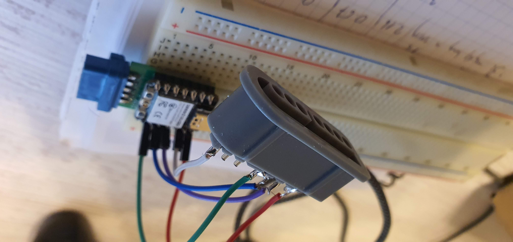

# 2024-03-01 - Dzień #001

Kolega z pracy namówił mnie na udział w konkursie [100 Commitów](https://100commitow.pl/). Od kilku miesięcy chodzi za mną pomysł zaprogramowania czegoś na Atari 2600. Pomyślałem, że konkurs to dobra okazja do zabawy i spróbowania czegoś zupełnie nowego. Postanowiłem napisać grę na Atari w ramach konkursu. Mam już pomysł, ale jeszcze go nie zdradzę.

Przygotowania rozpocząłem kilka tygodni temu. Poznaję narzędzia, instaluję środowisko pracy. Zacząłem także czytać książki:

1. Nick Montfort, Ian Bogost - [Racing the Beam](https://mitpress.mit.edu/9780262539760/racing-the-beam/) - zawiera analizę platformy Atari 2600 oraz kodu kilku słynnych gier z punktu widzenia programistycznego.
1. Jan Ruszczyc - [Asembler 6502](https://retronics.eu/?a=item&id=20&l=pl) - opis assemblera procesora 6502. Atari 2600 zawiera co prawda procesor 6507, ale jest to okrojona wersja 6502, więc zdobyta wiedza nie zmarnuje się.

Prawie zlamiłem pierwszego dnia! Zasady konkursu wymagają co najmniej jednego commita dziennie od autora repozytorium. W konfiguracji gita miałem podany błędny adres e-mail i moje wcześniejsze commity zaliczyły się na konto innego użytkownika Githuba! Na szczęście zauważyłem to w porę.

# 2024-03-02 - Dzień #002

Spędziłem noc czytając dokumentację języka Batari Basic, opisy "kerneli" stąd: [https://www.randomterrain.com/atari-2600-memories-batari-basic-commands.html](https://www.randomterrain.com/atari-2600-memories-batari-basic-commands.html)

Wygląda na to, że ograniczenia są dosłownie na każdym kroku. Zastanawiam się, jak je obejść, aby np. zrobić "dużego ludzika" w grze.

Kilka przykładów ograniczeń:

1. Atari 2600 ma 128 bajtów RAMu, ale tylko 26 jest dostępnych. Pozostałe są domyślnie użyte dla różnych celów.
1. Możesz narysować pięć poruszających się obiektów: 2 sprite'y graczy, 2 pociski (muszą być kwadratowe) i jedną piłkę.
1. Jeśli sprite ma używać więcej niż jednego koloru, nie użyjesz pocisku.
1. Nie ma prostej metody wyświetlenia tekstu (nie zacznę standardowym programem "hello world!").
1. Wersja binarna programu powinna mieć maksymalnie 4KB. Jeśli potrzeba więcej, można wykorzystać technikę przełączania banków pamięci, ale Atari w danym momencie ma dostęp tylko do jednego, 4-kilobajtowego banku.

Zacząłem pracować nad płytką kartridża. Dlaczego, skoro jeszcze nie mam ani jednej linijki gry? Chcę zamówić płytki jak najszybciej. Mogą dotrzeć nawet po 30 dniach. Jeśli popełniłem błąd, chciałbym mieć czas na jego poprawę.

Jednak wcześniej robiłem bardziej skomplikowane kartridże - na przykład [128-in-1 cartridge clone](https://youtu.be/PjKU597y_PI). Jestem przekonany, że mój projekt prostego kartridża 4KB także zadziała. Możecie znaleźć podobne projekty tu i ówdzie, na przykład: [https://grandideastudio.com/portfolio/gaming/pixels-past/](https://grandideastudio.com/portfolio/gaming/pixels-past/).

Projekt jest prosty, elegancki i sprawdzony w boju, ale chcę go jeszcze uprościć. Obecnie używam inwertera 74S04 i to tylko jednej z jego sześciu bramek. Nie potrzebuję układu scalonego, aby odwrócić jeden bit. Zamierzam użyć inwertera z tranzystora i dwóch rezystorów.

# 2024-03-03 - Dzień #003

Dziś pobawiłem się trochę edytorami sprite'ów i stworzyłem - na razie wstępną - wersję sprite'a postaci. Przywitajcie Bertę!

Nie jestem pewien, czy będę mógł go użyć w takiej formie ze względu na użyte kolory.

Sprawdziłem też, czy inwerter z tranzystora i dwóch rezystorów zadziała zgodnie z planem. Zadziałał!

# 2024-03-04 - Dzień #004

Dobra, wymieniłem układ scalony inwertera na inwerter bazujący na tranzystorze i zamówiłem płytki drukowane.

# 2024-03-05 - Dzień #005

Dziś eksperymentowałem ze sprite'ami. I wyjawiłem pomysł na grę :)
Wyświetliłem kilka sprite'ów. Gra jest dość statyczna, więc nie muszę ich animować. Chciałbym, aby gra była bardzo kolorowa (takie gry przemawiają do mnie bardziej, niż te z czarnym tłem), więc spróbowałem połączyć sprite'a z "polem gry", aby wyświetlić dużą Bertę:

Efekt jest jeszcze daleki od ideału, ale jestem właściwie przekonany, że zdołam wyświetlić to, co chcę.

# 2024-03-06 - Dzień #006

Postanowiłem, że wykorzystam bardziej tradycyjne metody projektowania. Rysuję sprite'y i "pole gry" ręcznie, ołówkiem. No dobra, używam tabletu reMarkable, a nie prawdziwego papieru. Powiedzmy, że wykorzystuję pół-tradycyjne metody ;)

Wiem już, że muszę połączyć "pole gry" ze spritem, aby wyświetlić wielokolorową, dużą postać. Główna trudność polega na tym, że "piksele" pola gry są prostokątne, a "piksele" sprite'a są kwadratowe i czasami jest trudno osiągnąć pożądany efekt. Tutaj szyja Berty jest zbyt długa, ale nie mogę jej skrócić, bo nie mogę podzielić "piksela" pola gry:

Gdy widzę inną grę na Atari 2600, automatycznie myślę o tym, jak była zrobiona. Przykładowo, [Combat](https://youtu.be/3m86ftny1uY) to prezentacja bezpośredniego wykorzystania możliwości konsoli: wyświetlenia dwóch sprite'ów i dwóch pocisków na polu gry.  [Breakout](https://youtu.be/tT70Tv6D41o) najwyraźniej wykorzystuje sprite'a na paletkę, do tego piłkę i klocki z "pikseli" pola gry.

# 2024-03-07 - Dzień #007

Kontynuowałem ręczne projektowanie. Zakodowałem też sprite i "pole gry", aby po raz pierwszy wyświetlić Bertę we właściwej postaci!

# 2024-03-08 - Dzień #008

Dziś przerwa :)
Mogę wrzucić widok płytki PCB, która się aktualnie produkuje:

No dobra, poeksperymentowałem troszkę z obsługą joysticka.

# 2024-03-09 - Dzień #009

Dodałem drugi sprite - na siatkę na motyle. To ostatni sprite jaki mogę użyć :)

Zacząłem myśleć o sterowaniu joystickiem. Na oryginalnej grze G&W potrzeba tylko jednego wciśnięcia przycisku, aby poruszyć postać w zadanym kierunku (góra-lewo, góra-prawo, dół-lewo, dół-prawo). Na Atari czasami będą potrzebne dwa ruchy joysticka. Na przykład, aby poruszyć Bertę z kierunku dół-lewo do góra-prawo, potrzeba poruszyć joystick w prawo i w górę. Inny kontroler, na przykład z Playstation czy Xboxa, byłby lepszy. Mógłbym wykorzystać strzałkę w górę, strzałkę w dół, trójkąt oraz krzyżyk. Być może zrobię specjalny adapter dla tej gry (albo nawet specjalny kontroler).

# 2024-03-10 - Dzień #010

Zmieniłem sprite z siatką na motyle na bardziej "realistyczny" :) Po pierwszych eksperymentach z obsługą joysticka teraz sprawiłem, że to Berta nieco się porusza. Wykorzystałem też rejestry REFP0 i REFP1, aby uzyskać lustrzane odbicie sprite'ów w zależności od tego, czy Berta jest obrócona w lewo, czy w prawo. Dzięki temu nie muszę zużywać pamięci ROMu na przechowywanie dwóch wariantów sprite'ów.

| Berta w pozycji góra-lewo| Berta w pozycji dół-prawo |
|----------------|---------------|
|||

# 2024-03-11 - Dzień #011

Poszerzyłem sprite siatki - jest dwa razy szerszy niż był. Zacząłem eksperymenty z dźwiękiem, ale jeszcze nie mam nic do commitnięcia...

Dodałem także eksperymentalną wersję "animacji" motylka. Motyle są zrobione z "pikseli pola gry", a ich modyfikacja jest kosztowna jeśli chodzi o cykle procesora. Prawdopodobnie nie wystarczy mi cykli, gdy będę chciał wyświetlić 4 czy 5 motyli jednocześnie.

# 2024-03-12 - Dzień #012

Nadszedł czas, aby zacząć myśleć o algorytmie rozgrywki. Chcę, aby doświadczenie gry było podobne jak w oryginale, ale nie identyczne. Przykładowo - nie zrobię zegarka ani budzika. Pamiętam też, że w oryginalnej grze czasami pojawiał się kogut i traciło się tylko połowę życia, gdy był widoczny. Nie mam miejsca na ekranie na "koguta", dlatego jego też odpuszczę.

Oryginalna konsola G&W używała mikroprocesora Sharp SM-5A, a rosyjskie konsole wykorzystywały jego klon - КБ1013ВК1-2. Milan Galcik stworzył disassembler tego procesora i wykonał inżynierię wsteczną gry w jajeczka:  [Sharp SM-5A Disassembler](https://www.septimus.sk/KB1013dbg/index.html). Jestem pełen podziwu dla jego pracy. Co prawda nie chcę stworzyć odpowiednika 1:1 gry, ale jego materiały na pewno będą pomocne.

# 2024-03-13 - Dzień #013

Dziś dodałem dźwięk do "animacji" motyla i brzmi on całkiem dobrze jak na moje uszy. Nie wspomniałem o tym wcześniej, ale możliwości dźwiękowe Atari 2600 są także bardzo ograniczone. (Jednak prawdziwy artysta może z nim zdziałać cuda - zobaczcie ten występ cTrixa: [https://youtu.be/S8e7g8kJIlo](https://youtu.be/S8e7g8kJIlo)).

Chcę zanurzyć się w oryginalnej grze, aby poznać ją najlepiej, jak to możliwe. Niestety, żadna z moich zabytkowych konsolek nie działa, ale od czego są emulatory?

# 2024-03-14 - Dzień #014

Dodałem brakujące motyle. Są one zrobione z "pikseli pola gry". Ich wyświetlanie jest kosztowne jeśli chodzi o cykle procesora. Na razie animują się poprawnie, ale będzie ich jeszcze więcej - nawet 12 w jednym momencie! Obstawiam, że to będzie za dużo. Prawdopodobnie kiedyś zmienię metodę "zapalania" "pikseli pola gry" na bardziej bezpośrednią, assemblero-podobną.

Dodałem też krzaki i chmurki :)

# 2024-03-15 - Dzień #015

Zmieniłem sposób, w jaki przechowywana jest pozycja Berty. Tak będzie ją łatwiej obsłużyć i porównywać pozycję ze "źródłami" motylków.

# 2024-03-16 - Dzień #016

Zaimplementowałem roboczą wersję algorytmu wypuszczania motylków. Działa całkiem dobrze, jednak kilka zmiennych jest w tej chwili zabitych na sztywno:

1. Maksymalna liczba motylków latających w jednym momencie - 3. W oryginalnej grze liczba ta zależy od aktualnego wyniku. 
1. Numer "źródła", które pauzuje i nie wypuszcza motylków. W oryginalnej grze zależy to od liczby żyć gracza.

# 2024-03-17 - Dzień #017

Dziś nic spektakularnego - odpoczywam :) Dostosowałem kolory wersji NTSC i ustawiłem ją jako domyślną, gdyż emulator domyślnie traktuje ROMy jako wersje NTSC. Oczywiście wersja PAL pozostaje dla mnie ważniejsza, bo chcę ją uruchomić na prawdziwej konsoli, a tę mam w wersji PAL.

# 2024-03-18 - Dzień #018

Próbowałem narysować Bertę na potrzeby przyszłej okładki kartridża i pudełka. Problem w tym, że nie umiem rysować. Na razie to mój najlepszy rezultat:

Inne rysunki są jeszcze gorsze. Jeden z nich pasowałby jako plakat do horroru Williama Wylera - [Kolekcjoner](https://www.imdb.com/title/tt0059043/).

Prawdopodobnie poprosze żonę o rysunek :)

# 2024-03-19 - Dzień #019

Bardzo chciałem zobaczyć, jak program zadziała na prawdziwym sprzęcie. Co prawda zamówione płytki jeszcze nie dotarły i jeszcze nie da się grać, ale mimo to poświęciłem kość EPROM i użyłem jednej z wcześniejszych płytek prototypowych, aby uruchomić Bertę!

Poruszałem trochę Bertą używając joysticka. Nie było aż tak źle, ale i tak zacząłem przymierzać się do skonstruowania adaptera pada, aby sterowanie było wygodniejsze. Zdecydowałem się na pady od Super Nintendo - ich zamienniki są tanie, mają odpowiednią liczbę przycisków do obsługi gry. Z padem od Playstation 4 byłoby więcej roboty, wymagałoby też użycia potężniejszego (droższego) mikrokontrolera. Zamówiłem gniazda pada od SNESa i zacząłem projektować płytkę adaptera.

# 2024-03-20 - Dzień #020

Wrzuciłem projekt płytki drukowanej adaptera kontrolera. Będzie wykorzystywał mikroprocesor Atmega8/48/88, który nie jest tak tani, jak kiedyś był, ale jest bardziej przyjazny hobbistom niż procesory w wersji SMD. Muszę go jeszcze zaprogramować, ale to nie powinno być problemem. Robiłem wcześniej podobne adaptery dla padów od NESa, które są podobne i różnią się tylko liczbą przycisków i wtyczką.

# 2024-03-21 - Dzień #021

Dziś urodziny żony i miałem zrobić sobie przerwę, ale dokonałem kilku drobnych poprawek w projekcie płytki adaptera pada:

# 2024-03-22 - Dzień #022

Berta od teraz może złapać motylka! Co prawda nie można jeszcze stracić życia, ale po raz pierwszy można zdobyć punkt :)

# 2024-03-23 - Dzień #023

Wrzuciłem pierwszą "grywalną" wersję na największe forum o Atari - [Atari Age](https://forums.atariage.com/topic/362557-berta-and-butterflies-in-development/?do=findComment&comment=5434927)

Liczę na jak najwcześniejsze opinie!

Zaimplementowałem też zależność maksymalnej liczby jednocześnie wypuszczonych motylków od aktualnego wyniku.

# 2024-03-24 - Dzień #024

Dziś wprowadziłem drobną poprawkę w algorytmie uwalniania motylków. Gdy nie ma żadnych motyli w powietrzu, wypuszczanie nie jest zależne od wyniku losowania. Wcześniej zdarzały się przerwy, kiedy nie wylatywały żadne motyle.

# 2024-03-25 - Dzień #025

Dotarły płytki kartridży! Niestety, nie znalazłem chwili, aby polutować pierwszy egzemplarz na próbę.

# 2024-03-26 - Dzień #026

Polutowałem pierwszy kartridż. Niestety, nie działa. Jedyna nowość w jego projekcie to inwerter oparty o tranzystor.
Spytałem [x_angela](http://ataripcb.pl/), który jest moim elektronicznym guru, jaki może być powód. Wygląda na to, że stan "niski" w Atari jest za wysoki (0.6V) i nie jest odwracany na 5V, a na 0V. Muszę go obniżyć przy użyciu dzielnika napięcia.

Poeksperymentowałem z wartościami rezystorów, ale bez efektu. Kartridż wciąż nie działa. Na ten moment sam nie wiem, co o tym myśleć, ale się nie poddam :)
 
# 2024-03-27 - Dzień #027

Wciąż bez sukcesu z inwerterem. W najgorszym razie użyję małego inwertera 74V1T14 z jedną bramką i umieszczę go jakoś na płytce. Ale najpierw poeksperymentuję dalej z rezystorami. Muszę sprawdzić, jakie są dokładne poziomy napięć w Atari przy użyciu oscyloskopu.

# 2024-03-28 - Dzień #028

Muszę zrobić przerwę od inwertera. Zamiast tego zacząłem pracę nad oprogramowaniem dla adaptera pada SNES. Przygotowałem prototypowy kabelek do eksperymentów:

# 2024-03-29 - Dzień #029

Postanowiłem sprawdzić, czy może na płytce kartridża są jakieś inne błędy. W tym celu podłączyłem "standardowy" inverter - 74S04. Z nim kartridż działa prawidłowo:

# 2024-03-30 - Dzień #030

Zbliża się Wielkanoc. Dziś nic wielkiego - dodałem wstępną obsługę straty życia.

# 2024-03-31 do 2024-04-01 - Dzień #031 i #032

# 2024-04-02 - Dzień #033

Wysłałem paczkę z płytką drukowaną i EPROMem do [x_angela](http://ataripcb.pl/), który pomoże mi w sprawieniu, aby inwerter zadziałał.

# 2024-04-03 - Dzień #034

Dziś pracowałem nad oprogramowaniem dla adaptera padów od SNESa. Tym razem robię prototyp przed zamówieniem płytek :)

# 2024-04-04 - Dzień #035

Dzięki [x_angelowi](http://ataripcb.pl/) kartridż z prostym inwerterem zadziałał! Dwie pierwsze fotki są z jego pola bitwy:

Rozwiązanie okazało się bardzo proste. Należy dodać kondensator 1nF równolegle do rezystora R1. [X_angel](http://ataripcb.pl/) mówi, że inwerter działa zbyt wolno, a kondensator go "przyspiesza".

Uwzględnię dodatkowy kondensator w projekcie, a na już zamówionych płytkach dolutuję go w następujący sposób:

# 2024-04-05 - Dzień #036

Zaprogramowałem adapter pada od SNESa. Te pady są łatwe do obsłużenia. W środku znajduje się rejestr przesuwny, który szeregowo przesyła dane o tym, które przyciski są wciśnięte.

Atmega8 wydaje się dobrym procesorem do adaptera, gdyż gniazdo joysticka w Atari 2600 nie ma zbyt dobrej wydajności prądowej i inne procesory (SAMD21, Pico, ESP32) mogłyby wcale nie zadziałać...

# 2024-04-06 - Dzień #037

Zaktualizowałem projekt płytki drukowanej kartridża, dodając kondensator, dzięki któremu działa inwerter.

Zmiana jest kosmetyczna. Kondensator lutuje się od drugiej strony płytki:

# 2024-04-07 - Dzień #038

Dziś chciałem kontynuować pracę nad głównym programem gry. Jednak zamiast tego 3 razy sprawdziłem, czy z projektem adaptera wszystko w porządku i zamówiłem płytki :)

# 2024-04-08 - Dzień #039

Wróciłem do głównego programu, czyli gry. Dodałem wstępną wersję "animiacji" straconego motylka.

Nie wspominałem o tym wcześniej, ale zamierzam użyć obudów od [Sikor Soft](http://sikorsoft.waw.pl/hardware/obudowy-na-cartridge-2600-7800/) do kartridży. Są bardzo dobrej jakości, zrobione na wtryskarce, a nie za pomocą druku 3D. Sprawdziłem, czy płytki pasują:

Pasują idealnie!

Obudowy istnieją w dwóch kolorach - czarnym i białym. Białe bardziej pasują mi do Berty.

# 2024-04-09 - Dzień #040

Dodałem animację utraconego motylka. Nie jestem z niej w pełni zadowolony i prawdopodobnie później ją trochę dostroję.

Dodałem też funkcję "końca gry". Kiedy stracisz życia, nowe motylki się nie pojawią.

To dobre wiadomości. Zła wiadomość jest taka, że zostało mi tylko 855 bajtów! Chciałbym dodać co najmniej ekran tytułowy z muzyką i dwa poziomy trudności... Mam nadzieję, że te 855 bajtów mi wystarczy.

# 2024-04-10 - Dzień #041

Od teraz motylki są uwalniane z rosnącą prędkością, gra stała się trudniejsza.

"Pauzujące" źródło motyli zmienia się po każdej utracie życia.

# 2024-04-11 - Dzień #042

Udostępniłem obecną wersję współpracownikom z mojego zespołu. Grali w online'owym emulatorze [Javatari](https://javatari.org/). Oto aktualny, najwyższy wynik:

# 2024-04-12 - Dzień #043

Dodałem drugi poziom trudności, dostroiłem trochę prędkość, dodałem opcję wyłączenia dźwięku.

Mimo, że zastosowałem kilka optymalizacji, zostało mi już jedynie 778 bajtów.

# 2024-04-13 - Dzień #044

Dziś dodałem ekran tytułowy. Na razie w wersji polskiej. Jak się podoba?

# 2024-04-14 - Dzień #045

Dodałem muzykę tytułową. Aczkolwiek, na moje ucho jest trochę za szybka.

# 2024-04-15 - Dzień #046

Zdołałem spowolnić muzyczkę tytułową i sprawić, że brzmi tak, jak chciałem.

# 2024-04-16 - Day #047

Kiedy gra się zakończy, można teraz wrócić do ekranu tytułowego i zacząć ponownie.
