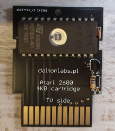
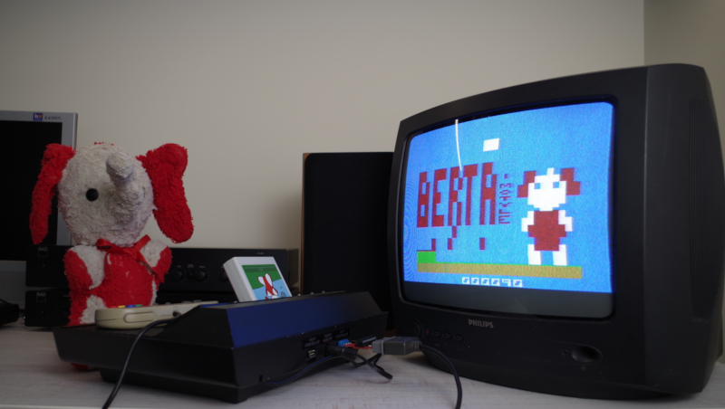

# Berta And Butterflies

> *TL;DR* If you just want to play the game, click [here](https://javatari.org/?ROM=https://github.com/vandalton/BertaAndButterflies/releases/download/v1.00/berta-and-butterflies.v1.00.ntsc.en.bin)
> 
> You can also see the demo on Youtube (in Polish): [https://www.youtube.com/shorts/mCUAv41lA1o?feature=share](https://www.youtube.com/shorts/mCUAv41lA1o?feature=share)

**Berta And Butterflies** is a game for Atari 2600 console.

It's a remake of the LCD game from the original ["Game & Watch"](https://nintendo.fandom.com/wiki/Egg) series from the '80. In Poland original Nintendo games were virtually unknown, but soviet clones made by [Elektronika](https://en.wikipedia.org/wiki/Elektronika) were very popular:

I wanted to write a game for Atari 2600. I know this console is extremely limited. On the other hand, this game is very simple, but still very enjoyable and fun. It looked like a good candidate to port it to Atari.

I replaced the character with my wife's Alice favorite stuffed toy from childhood - a small elephant called Berta.

| Original Berta | Digital Berta |
|----------------|---------------|
|||

As for 06 Jun 2024 the game is completed and I won't add any new features to the standard, 4KB version. Even if I wanted to, I have no spare place in the ROM - I can't even add one note more to the title music :)

The game's source file is in [software/atari2600-game](./software/atari2600-game/) folder. To compile it you'll need [batari Basic](https://github.com/batari-Basic/batari-Basic), however, you can download precompiled, binary version from the [releases](https://github.com/vandalton/BertaAndButterflies/releases/) page.

Besides the game, there are also three sub-projects within this repository:

1. A printed circut board design to create the simplest cartridge for any 4KB Atari 2600 game (**Berta And Butterflies** is also 4KB game) - [more details](./hardware/atari2600-simplest-cart/README.md).

   
2. Super Nintendo controller adapter, to control Berta in a different way than with a standard joystick - [more details](./hardware/snes-to-db9-controller-adapter/README.md).

   
3. Real Time Clock circuit design for Atari 2600, attachable to the second player's joystick port - [more details](./hardware/atari2600-rtc/README.md) (it is at experimental stage).

Although the game is completed, I'm going to develop it further and create 8KB version with RTC support - current time will be displayed on the title screen. That will make the game even more similiar to the original "Game & Watch" ;)

## How to play?

I recommend to play this game on a real console. It will work with any version, whether it is "Woody" from 1977, "Junior" from 80' or the most recent 2600+ from 2023.

If you have basic soldering skills, you can etch cartridge PCBs and make a real [cartridge](#cartridge). There will be also a limited run of physical cartridges released at some point in the near future. If you have a "universal" cartridge like Harmony or UnoCart, you can put the ROM there and load the game from it (however, these "universal" carts don't work with 2600+, as far as I know).

If you don't have Atari console, you can use emulator. There is plenty of Atari 2600 emulators to choose from:

1. [Javatari](https://javatari.org/?ROM=https://github.com/vandalton/BertaAndButterflies/releases/download/v1.00/berta-and-butterflies.v1.00.ntsc.en.bin) - an emulator that works in browser.
2. [Stella](https://stella-emu.github.io/) - probably the most well-known Atari 2600 emulator. There are versions for Windows, MacOS and Linux.
3. [Gopher2600](https://github.com/JetSetIlly/Gopher2600) - an emulator written in Go.

Just download the most recent ROM from [releases](https://github.com/vandalton/BertaAndButterflies/releases) page and load it in the emulator.

You can also use a device like Anbernic handheld with built-in Atari 2600 emulator (it uses Stella emulator internally):

While you are on the title screen, you can select difficulty level using console's difficulty switch (F4 in Javatari). The cloud is one of the level indicators. If it's over "B" letter it means "beginner", while "A" means "advanced". Another indicator is net's color - it is red in the advanced mode.

## Cartridge

Using elements from this repository and a few from outside it, you can make your own, real cartridge with the game. Only basic soldering skills are needed. You'll need:

- [Cartridge printed circuit board](./hardware/atari2600-simplest-cart/README.md) and a few electronic components, in particular a programmed EPROM memory.
- A case from [Sikor Soft](http://sikorsoft.waw.pl/hardware/obudowy-na-cartridge-2600-7800/).
- [Cover stickers](https://github.com/vandalton/BertaAndButterflies/releases/download/v1.00/cover.en.pdf). The PDF file has two layers. One layer contains everything that should be visible, and the second layer contains a pattern for cutting machines.

## History

I started this project to take part in [100 Commits](https://100commitow.pl/) competition.

Recently I was fascinated by Atari 2600 console and I wanted to write a program for it, which is allegedly very hard. This machine has only 128 bytes of RAM (it's not a mistake!) and has no graphics memory at all. There is even no such term as 'pixel'.

I want to check how hard it really is. I have no prior experience with 6502/6507 assembler, [batari Basic](https://github.com/batari-Basic/batari-Basic) etc. The competition motivates me to learn it :)

More details in [diary](./DIARY.md).

### Competition summary

Today (8 June 2024) is the last day of the competition. So much has happened during these 100 days! I've learned a lot and created a fully-fledged product - a game for Atari 2600 that one can play and find some joy in. I also met the requirement set by my wife - Berta’s character in the game had to be recognizable ;) Berta appeared on YouTube, on [Zero Page Homebrew](https://youtu.be/SA3xd5n5TF4?t=3413) and [DevMentors](https://youtu.be/TQQvmo6iMdc?t=1981) channels, as well as in an article on [AtariOnline](https://atarionline.pl/v01/index.php?subaction=showfull&id=1715228764&archive=&start_from=0&ucat=1&ct=nowinki). Despite a few moments of doubt caused by console's limitations, I completed the project. It wouldn’t have been possible without the help of many people. Alka_ja, Bartass, Kaziu, Milan Galcik, Sikor, x_angel - I thank you all! I’m also grateful for every star on GitHub, every test, and all the critical feedback. Even if I don’t make it to the finals, it was still worth it. The wealth of new experiences and skills is the most valuable reward. Although it would be great to add a sequel to this story!

And here is a sequel: "Berta and Butterflies" won the contest! I'm so happy! More detail in the [diary](./DIARY.md).

## How to contribute?

Many people helped me with this project, although not with means of GitHub pull-requests. Despite the standard version of the game won't change (it is already hardcoded on many cartridges), I have plenty of ideas for a possible future enhanced version. So, if you would like to help me, just fork this repo and create a pull-request - I'll review it.

Some of ideas:

- Support for real time clock (already in progress, you can see the time, but you can't set it).
- ROM size optimizations - I would love to fit the game together with RTC support in 4KB :)
- Two player mode (alternating).
- [SaveKey](https://atariage.com/store/index.php?l=product_detail&p=1194) support - although I don't find it very useful ;)
- Different color variations.
- Expanded title music.

## Would you like to create your own game for the Atari 2600?

Game programming itself is a challenge and provides a lot of satisfaction. Programming for the Atari 2600 is an even greater challenge, but the satisfaction is also much greater. The console’s limitations are enormous, and you need to think creatively to fit within them and create something playable. For example, in the case of Berta, even rendering a two-color, large character was quite difficult.

Players often asked me whether Berta could have an outline (she cannot), whether it could have eyes that aren't "holes" (she cannot), or whether butterflies could be different colors (they cannot). This should give you an idea of the scale of the console’s limitations.

In my experience, the following sources were invaluable:

- [batari Basic Commands](https://www.randomterrain.com/atari-2600-memories-batari-basic-commands.html#multikernel)
- Nick Montfort, Ian Bogost - [Racing the Beam](https://mitpress.mit.edu/9780262539760/racing-the-beam/).

I recommend starting with these two resources.

Note: Thinking about overcoming console limitations can be not only challenging but also addictive and dangerous! In the article [Brickbasher:How The Atari 2600 Almost Killed Me!](https://intotheverticalblank.com/2021/03/13/brickbasher-2600-wip/) the author describes his experiences related to creating a game for the Atari 2600. Once, he became so engrossed in his thoughts that he forgot he was driving, ran a red light, and almost caused an accident.

Fortunately, I haven’t experienced anything like that, but consider yourself warned!
