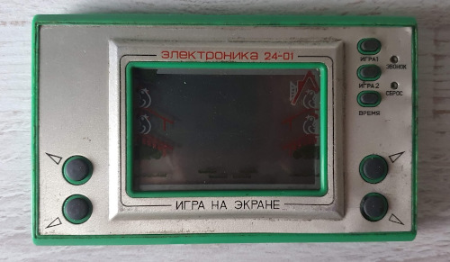
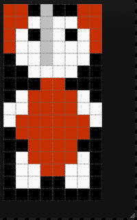

# Berta And Butterflies

In this repository hopefully you will find a game for Atari 2600 one day.
The project will consists not only of a code, but also a cartridge design, labels, box - all stuff needed to create a game that could be run on a real machine. 

The idea is to make a remake of the LCD game from the original ["Game & Watch"](https://nintendo.fandom.com/wiki/Egg) series from the '80.

In Poland original Nintendo games were virtually unknown, but soviet clones made by [Elektronika](https://en.wikipedia.org/wiki/Elektronika) were very popular:

My primary goal is to write a game for Atari 2600. I know this console is very limited. On the other hand, this game is very simple, but still very enjoyable and fun. It looks like a good candidate to port it to Atari.

I want to replace the character with my wife's Alice favourite stuffed toy from childhood - a small elephant called Berta.

| Original Berta | Digital Berta |
|----------------|---------------|
|||

## History

I started this project to take part in [100 Commits](https://100commitow.pl/) competition.

Recently I was fascinated by Atari 2600 console and I wanted to write a program for it, which is allegedly very hard. This machine has only 128 bytes of RAM (it's not a mistake!) and has no graphics memory at all. There is even no such term as 'pixel'. 

I want to check how hard it really is. I have no prior experience with 6502/6507 assembler, Batari Basic etc. The competition motivates me to learn it :)

More details in [diary](./DIARY.md).
