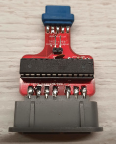
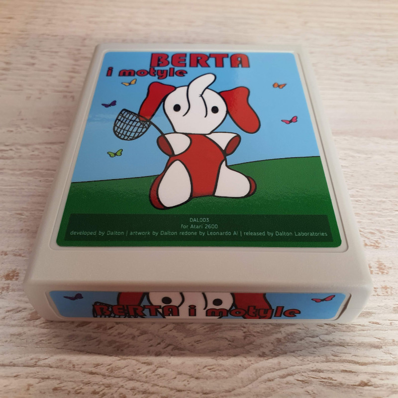

# Berta And Butterflies

> *TL;DR* If you just want to play the game, click [here](https://javatari.org/?ROM=https://github.com/vandalton/BertaAndButterflies/releases/download/v1.00/berta-and-butterflies.v1.00.ntsc.en.bin)

**Berta And Butterflies** is a game for Atari 2600 console.

It's a remake of the LCD game from the original ["Game & Watch"](https://nintendo.fandom.com/wiki/Egg) series from the '80. In Poland original Nintendo games were virtually unknown, but soviet clones made by [Elektronika](https://en.wikipedia.org/wiki/Elektronika) were very popular:

I wanted to write a game for Atari 2600. I know this console is extremely limited. On the other hand, this game is very simple, but still very enjoyable and fun. It looked like a good candidate to port it to Atari.

I replaced the character with my wife's Alice favorite stuffed toy from childhood - a small elephant called Berta.

| Original Berta | Digital Berta |
|----------------|---------------|
|||

As for 06 Jun 2024 the game is completed and I won't add any new features to the standard, 4KB version. Even if I wanted to, I have no spare place in the ROM - I can't even add one note more to the title music :)

The game's source file is in [software/atari2600-game](./software/atari2600-game/) folder. To compile it you'll need [batari Basic](https://github.com/batari-Basic/batari-Basic), however, you can download precompiled, binary version from the [releases](https://github.com/vandalton/BertaAndButterflies/releases/) page.

Besides the game, there are also three sub-projects within this repository:

1. A printed circut board design to create the simplest cartridge for any 4KB Atari 2600 game (**Berta And Butterflies** is also 4KB game) - [more details](./hardware/atari2600-simplest-cart/README.md).

   
2. Super Nintendo controller adapter, to control Berta in a different way than with a standard joystick - [more details](./hardware/snes-to-db9-controller-adapter/README.md).

   
3. Real Time Clock circuit design for Atari 2600, attachable to the second player's joystick port (it is at experimental stage).

Although the game is completed, I'm going to develop it further and create 8KB version with RTC support - current time will be displayed on the title screen. That will make the game even more similiar to the original "Game & Watch" ;)

## How to play?

I recommend to play this game on a real console. It will work with any version, whether it is "Woody" from 1977, "Junior" from 80' or the most recent 2600+ from 2023.

If you have basic soldering skills, you can etch cartridge PCBs and make a real [cartridge](#cartridge). There will be also a limited run of physical cartridges released at some point in the near future. If you have a "universal" cartridge like Harmony or UnoCart, you can put the ROM there and load the game from it (however, these "universal" carts don't work with 2600+, as far as I know).

If you don't have Atari console, you can use emulator. There is plenty of Atari 2600 emulators to choose from:

1. [Javatari](https://javatari.org/?ROM=https://github.com/vandalton/BertaAndButterflies/releases/download/v1.00/berta-and-butterflies.v1.00.ntsc.en.bin) - an emulator that works in browser.
2. [Stella](https://stella-emu.github.io/) - probably the most well-known Atari 2600 emulator. There are versions for Windows, MacOS and Linux.
3. [Gopher2600](https://github.com/JetSetIlly/Gopher2600) - an emulator written in Go.

Just download the most recent ROM from [releases](https://github.com/vandalton/BertaAndButterflies/releases) page and load it in the emulator.

You can also use a device like Anbernic handheld with built-in Atari 2600 emulator (it uses Stella emulator internally):

## Cartridge

Using elements from this repository and a few from outside it, you can make your own, real cartridge with the game. Only basic soldering skills are needed. You'll need:

- [Cartridge printed circuit board](./hardware/atari2600-simplest-cart/README.md) and a few electronic components, in particular a programmed EPROM memory.
- A case from [Sikor Soft](http://sikorsoft.waw.pl/hardware/obudowy-na-cartridge-2600-7800/).
- [Cover stickers](https://github.com/vandalton/BertaAndButterflies/releases/download/v1.00/cover.pdf). The PDF file has two layers. One layer contains everything that should be visible, and the second layer contains a pattern for cutting machines.

## History

I started this project to take part in [100 Commits](https://100commitow.pl/) competition.

Recently I was fascinated by Atari 2600 console and I wanted to write a program for it, which is allegedly very hard. This machine has only 128 bytes of RAM (it's not a mistake!) and has no graphics memory at all. There is even no such term as 'pixel'.

I want to check how hard it really is. I have no prior experience with 6502/6507 assembler, [batari Basic](https://github.com/batari-Basic/batari-Basic) etc. The competition motivates me to learn it :)

More details in [diary](./DIARY.md).
