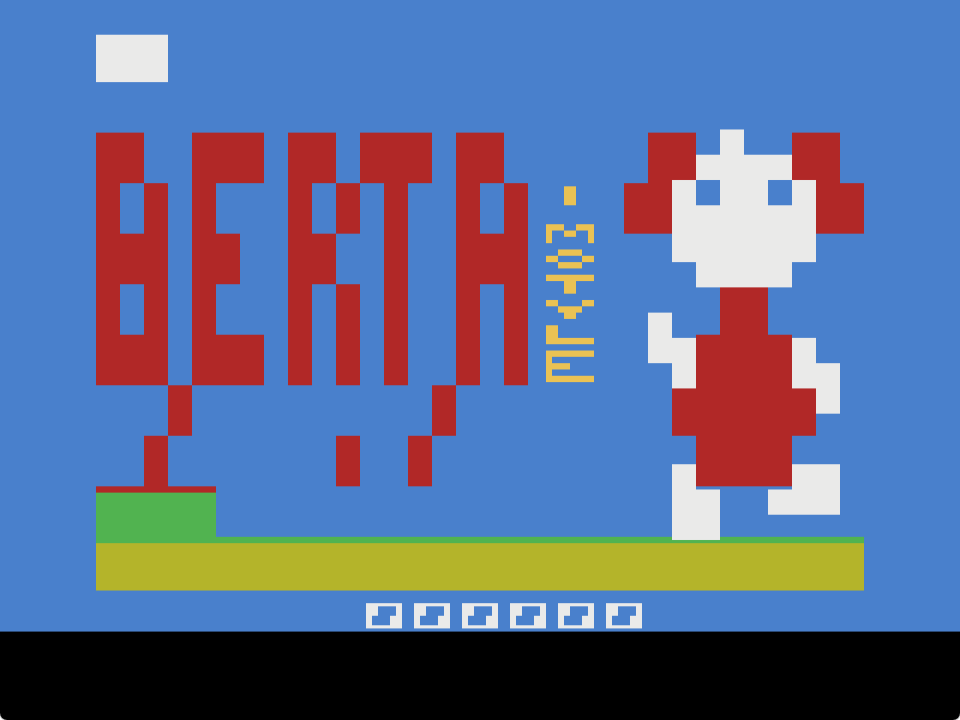
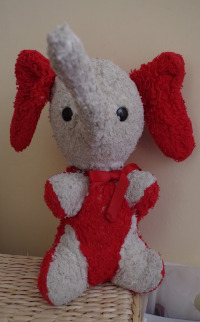
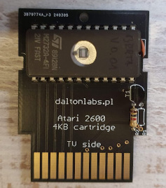
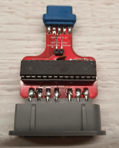
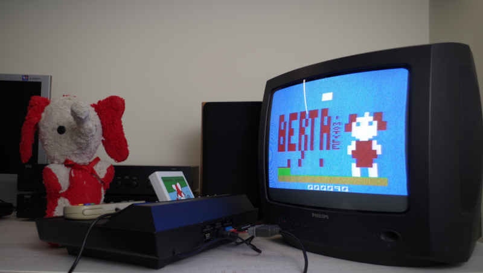
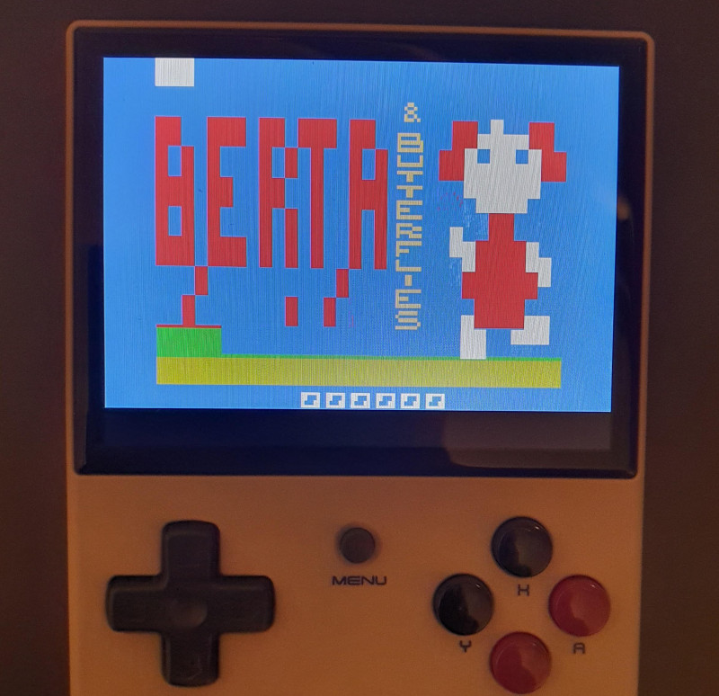

# Berta i motyle

**Berta i motyle** to gra na konsolę Atari 2600.

> *TL;DR* Jeśli chcesz po prostu zagrać w grę, kliknij [tutaj](https://javatari.org/?ROM=https://github.com/vandalton/BertaAndButterflies/releases/download/v1.00/berta-and-butterflies.v1.00.ntsc.pl.bin)

Pomysł polega na przeniesieniu gry z konsoli LCD z oryginalnej serii ["Game & Watch"](https://nintendo.fandom.com/wiki/Egg) z lat 80'. W Polsce konsole Nintendo były właściwie nieznane, ale bardzo popularne były sowieckie klony produkcji firmy [Elektronika](https://en.wikipedia.org/wiki/Elektronika):

Od jakiegoś czasu chciałem stworzyć grę na Atari 2600. Wiem, że ta konsola ma wybitnie ograniczone możliwości. Natomiast ta gra jest bardzo prosta, ale mimo to wciągająca i dająca dużo frajdy. Wydała mi się dobrym kandydatem na przeportowanie na Atari.

Postać w grze zamieniłem na ulubioną maskotkę z dzieciństwa mojej żony, Alicji - małą słonicę o imieniu Berta.

| Prawdziwa Berta | Cyfrowa Berta |
|----------------|---------------|
|||

Na dzień 6 czerwca 2024 gra jest ukończona i nie planuję dodawać nic nowego do jej standardowej, 4-kilobajtowej wersji. Nawet gdybym chciał, nie mam miejsca w ROMie - nie mogę nawet dodać jednej nutki do muzyki tytułowej :)

Źródła gry znajdują się w folderze [software/atari2600-game](./software/atari2600-game/). Do ich skompilowania potrzebny jest [batari Basic](https://github.com/batari-Basic/batari-Basic), ale w sekcji [releases](https://github.com/vandalton/BertaAndButterflies/releases/) udostępnione są binarne wersje gry.

Oprócz gry, w repozytorium znajdują się trzy podprojekty:

1. Projekt płytki drukowanej umożliwiającej stworzenie najprostszego kartridża z grą 4KB dla Atari 2600 (**Berta i motyle** zajmuje właśnie 4KB) - [szczegóły](./hardware/atari2600-simplest-cart/README.pl.md).

   
2. Adapter padów od Super Nintendo, aby sterować Bertą w inny sposób, niż przy użyciu standardowego joysticka - [szczegóły](./hardware/snes-to-db9-controller-adapter/README.pl.md).

    
3. Projekt układu zegara czasu rzeczywistego dla Atari 2600, podłączanego do portu joysticka drugiego gracza (projekt jest w fazie eksperymentalnej).  

Co prawda gra jest ukończona, ale planuję kontynuować rozwój projektu i stworzyć wersję 8-kilobajtową ze wsparciem dla zegara czasu rzeczywistego. Aktualna godzina będzie się wyświetlać na ekranie tytułowym. Dzięki temu gra będzie jeszcze bardziej podobna do oryginalnej konsolki "Game & Watch" ;)

## Jak grać?

Polecam grać w grę na prawdziwej konsoli. Zadziała pod dowolną wersją, obojętnie, czy to "Woody" z 1977, "Junior" z lat 80', czy najnowsza wersja 2600+ z 2023.

Jeśli posiadasz podstawowe umiejętności lutowania, możesz zamówić płytkę drukowaną i zrobić prawdziwy [kartridż](#kartridż). W niedalekiej przyszłości planuję też wydać limitowaną serię kartridży z grą. Jeśli posiadasz "uniwersalny" kartridż typu Harmony albo UnoCart, możesz skopiować ROM na niego i załadować grę (chociaż z tego co wiem, te "uniwersalne" kartridże nie działają z wersją 2600+ konsoli).

Jeśli nie posiadasz konsoli Atari, możesz użyć emulatora. Jest ich wiele do wyboru:

1. [Javatari](https://javatari.org/?ROM=https://github.com/vandalton/BertaAndButterflies/releases/download/v1.00/berta-and-butterflies.v1.00.ntsc.pl.bin) - emulator działający w przeglądarce.
2. [Stella](https://stella-emu.github.io/) - prawdopodobnie najbardziej znany emulator Atari 2600. Istnieją jego wersje pod Windowsa, MacOSa i Linuksa.
3. [Gopher2600](https://github.com/JetSetIlly/Gopher2600) - emulator napisany w Go.

Wystarczy, że ściągniesz najświeższą wersję ROMu ze strony [releases](https://github.com/vandalton/BertaAndButterflies/releases) i załadujesz go w emulatorze.

Możesz także użyć urządzenia typu konsolka Anbernic z wbudowanym emulatorem Atari 2600 (wewnętrznie używa emulatora Stella):

## Kartridż

Wykorzystując elementy znajdujące się w tym repozytorium oraz kilka spoza, możesz stworzyć prawdziwy kartridż z grą. Wystarczą Ci podstawowe umiejętności lutowania. Będziesz potrzebował:

- [Płytkę drukowaną kartridża](./hardware/atari2600-simplest-cart/README.pl.md), wraz z kilkoma innymi elektronicznymi częściami, w szczególności z zaprogramowaną pamięcią EPROM.
- Obudowę od [Sikor Soft](http://sikorsoft.waw.pl/hardware/obudowy-na-cartridge-2600-7800/).
- [Naklejki](https://github.com/vandalton/BertaAndButterflies/releases/download/v1.00/cover.pl.pdf). Plik PDF jest warstwowy. Jedna warstwa zawiera to, co powinno być widoczne, a druga wykrój dla maszyn tnących.

## Historia

Rozpocząłem ten projekt, aby wziąć udział w konkursie [100 Commitów](https://100commitow.pl/).

Niedawno zafascynowałem się konsolą Atari 2600 i chciałem coś na nią zaprogramować, co jest rzekomo bardzo trudne. Maszyna ta posiada 128 bajtów RAMu (to nie pomyłka!) i nie posiada wcale pamięci graficznej. Nie istnieje nawet taki termin jak 'piksel'.

Chcę się przekonać, jak trudne to faktycznie jest. Nie mam wcześniejszego doświadczenia z assemblerem 6502/6507, Batari Basicem itp. Konkurs motywuje mnie, aby się ich nauczyć :)

Więcej w [dzienniku](./DIARY.pl.md).

### Podsumowanie konkursu

Dziś (8 czerwca 2024) ostatni dzień konkursu. Tyle się wydarzyło przez te 100 dni! Dużo się nauczyłem i stworzyłem pełnoprawny produkt, grę na Atari 2600, w którą da się zagrać i mieć z tego chociaż chwilę radości. Spełniłem też wymaganie postawione przez Żonę - postać Berty w grze miała być możliwa do rozpoznania ;) Berta pojawiła się na Youtube, na kanałach [Zero Page Homebrew](https://youtu.be/SA3xd5n5TF4?t=3413) oraz [DevMentors](https://youtu.be/TQQvmo6iMdc?t=1981), a także w artykule na portalu [AtariOnline](https://atarionline.pl/v01/index.php?subaction=showfull&id=1715228764&archive=&start_from=0&ucat=1&ct=nowinki). Pomimo kilku momentów zwiątpienia, spowodowanych ograniczeniami konsoli, doprowadziłem projekt do końca. Nie byłoby to możliwe bez pomocy wielu osób. Alka_ja, Bartass, Kaziu, Milan Galcik, Sikor, x_angel - dziękuję! Dziękuję też za każdą gwiazkę na Githubie, każde testy i wszelkie krytyczne uwagi. Nawet, jeśli nie wejdę do finału, to i tak było warto. Taka masa nowych doświadczeń i umiejętności to najcenniejsza nagroda! Aczkolwiek super byłoby dopisać tu kiedyś ciąg dalszy!
