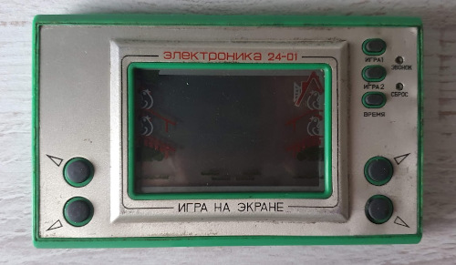
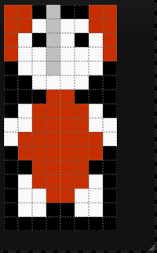

# Berta i motyle

Mam nadzieję, że w tym repozytorium pewnego dnia znajdzie się gra na Atari 2600.
Projekt będzie się składał nie tylko z kodu, ale także z płytki kartridża, etykiet, pudełka - wszystkiego, co potrzebne, aby stworzyć grę możliwą do uruchomienia na prawdziwej konsoli.

Pomysł polega na przeniesieniu gry z konsoli LCD z oryginalnej serii ["Game & Watch"](https://nintendo.fandom.com/wiki/Egg) z lat 80'.

W Polsce oryginalne konsole Nintendo były właściwie nieznane, ale bardzo popularne były sowieckie klony produkcji firmy [Elektronika](https://en.wikipedia.org/wiki/Elektronika):

Mój główny cel to napisanie gry na Atari 2600. Wiem, że ta konsola ma bardzo ograniczone możliwości. Z kolei ta gra jest bardzo prosta, ale wciągająca i dająca dużo frajdy. Wydaje się dobrym kandydatem na przeportowanie na Atari.

Jako postać w grze chcę wykorzystać ulubioną maskotkę z dzieciństwa mojej żony, Alicji - małą słonicę o imieniu Berta.

| Prawdziwa Berta | Cyfrowa Berta |
|----------------|---------------|
|||

## Historia

Rozpocząłem ten projekt, aby wziąć udział w konkursie [100 Commitów](https://100commitow.pl/).

Niedawno zafascynowałem się konsolą Atari 2600 i chciałem coś na nią zaprogramować, co jest rzekomo bardzo trudne. Maszyna ta posiada 128 bajtów RAMu (to nie pomyłka!) i nie posiada wcale pamięci graficznej. Nie istnieje nawet taki termin jak 'piksel'.

Chcę się przekonać, jak trudne to faktycznie jest. Nie mam wcześniejszego doświadczenia z assemblerem 6502/6507, Batari Basicem itp. Konkurs motywuje mnie, aby się ich nauczyć :)

Więcej w [dzienniku](./DIARY.pl.md).

