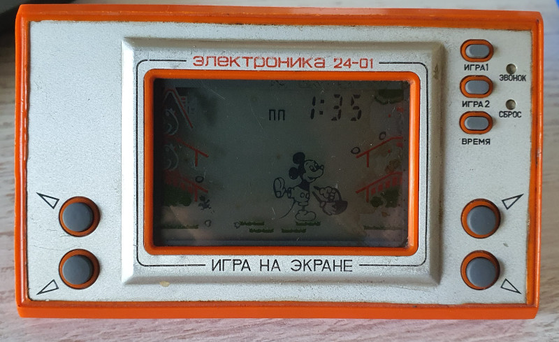

# Berta i motyle

**Berta i motyle** to gra na konsolę Atari 2600.

> *TL;DR* Jeśli chcesz po prostu zagrać w grę, kliknij [tutaj](https://javatari.org/?ROM=https://github.com/vandalton/BertaAndButterflies/releases/download/v1.00/berta-and-butterflies.v1.00.ntsc.pl.bin)
> 
> Możesz też zobaczyć demo na Youtube: [https://www.youtube.com/shorts/mCUAv41lA1o?feature=share](https://www.youtube.com/shorts/mCUAv41lA1o?feature=share)

Pomysł polega na przeniesieniu gry z konsoli LCD z oryginalnej serii ["Game & Watch"](https://nintendo.fandom.com/wiki/Egg) z lat 80'. W Polsce konsole Nintendo były właściwie nieznane, ale bardzo popularne były sowieckie klony produkcji firmy [Elektronika](https://en.wikipedia.org/wiki/Elektronika):

Od jakiegoś czasu chciałem stworzyć grę na Atari 2600. Wiem, że ta konsola ma wybitnie ograniczone możliwości. Natomiast ta gra jest bardzo prosta, ale mimo to wciągająca i dająca dużo frajdy. Wydała mi się dobrym kandydatem na przeportowanie na Atari.

Postać w grze zamieniłem na ulubioną maskotkę z dzieciństwa mojej żony, Alicji - małą słonicę o imieniu Berta.

| Prawdziwa Berta | Cyfrowa Berta |
|----------------|---------------|
|||

Na dzień 6 czerwca 2024 gra jest ukończona i nie planuję dodawać nic nowego do jej standardowej, 4-kilobajtowej wersji. Nawet gdybym chciał, nie mam miejsca w ROMie - nie mogę nawet dodać jednej nutki do muzyki tytułowej :)

Źródła gry znajdują się w folderze [software/atari2600-game](./software/atari2600-game/). Do ich skompilowania potrzebny jest [batari Basic](https://github.com/batari-Basic/batari-Basic), ale w sekcji [releases](https://github.com/vandalton/BertaAndButterflies/releases/) udostępnione są binarne wersje gry.

Oprócz gry, w repozytorium znajdują się trzy podprojekty:

1. Projekt płytki drukowanej umożliwiającej stworzenie najprostszego kartridża z grą 4KB dla Atari 2600 (**Berta i motyle** zajmuje właśnie 4KB) - [szczegóły](./hardware/atari2600-simplest-cart/README.pl.md).

   
2. Adapter padów od Super Nintendo, aby sterować Bertą w inny sposób, niż przy użyciu standardowego joysticka - [szczegóły](./hardware/snes-to-db9-controller-adapter/README.pl.md).

    
3. Projekt układu zegara czasu rzeczywistego dla Atari 2600, podłączanego do portu joysticka drugiego gracza - [szczegóły](./hardware/atari2600-rtc/README.pl.md) (projekt jest w fazie eksperymentalnej).  

Co prawda gra jest ukończona, ale planuję kontynuować rozwój projektu i stworzyć wersję 8-kilobajtową ze wsparciem dla zegara czasu rzeczywistego. Aktualna godzina będzie się wyświetlać na ekranie tytułowym. Dzięki temu gra będzie jeszcze bardziej podobna do oryginalnej konsolki "Game & Watch" ;)

## Jak grać?

Polecam grać w grę na prawdziwej konsoli. Zadziała pod dowolną wersją, obojętnie, czy to "Woody" z 1977, "Junior" z lat 80', czy najnowsza wersja 2600+ z 2023.

Jeśli posiadasz podstawowe umiejętności lutowania, możesz zamówić płytkę drukowaną i zrobić prawdziwy [kartridż](#kartridż). W niedalekiej przyszłości planuję też wydać limitowaną serię kartridży z grą. Jeśli posiadasz "uniwersalny" kartridż typu Harmony albo UnoCart, możesz skopiować ROM na niego i załadować grę (chociaż z tego co wiem, te "uniwersalne" kartridże nie działają z wersją 2600+ konsoli).

Jeśli nie posiadasz konsoli Atari, możesz użyć emulatora. Jest ich wiele do wyboru:

1. [Javatari](https://javatari.org/?ROM=https://github.com/vandalton/BertaAndButterflies/releases/download/v1.00/berta-and-butterflies.v1.00.ntsc.pl.bin) - emulator działający w przeglądarce.
2. [Stella](https://stella-emu.github.io/) - prawdopodobnie najbardziej znany emulator Atari 2600. Istnieją jego wersje pod Windowsa, MacOSa i Linuksa.
3. [Gopher2600](https://github.com/JetSetIlly/Gopher2600) - emulator napisany w Go.

Wystarczy, że ściągniesz najświeższą wersję ROMu ze strony [releases](https://github.com/vandalton/BertaAndButterflies/releases) i załadujesz go w emulatorze.

Możesz także użyć urządzenia typu konsolka Anbernic z wbudowanym emulatorem Atari 2600 (wewnętrznie używa emulatora Stella):

Gdy jestes na ekranie tytułowym, możesz wybrać poziom trudności używając przełącznika konsoli (F4 w Javatari).
Chmurka wskazuje poziom trudności. Gdy jest nad literą "B", mamy wybrany poziom łatwy (*beginner*), a gdy nad "A", poziom trudny (*advanced*). Kolejnym wskaźnikiem poziomu jest kolor siatki - w trudnym jest czerwony.

## Kartridż

Wykorzystując elementy znajdujące się w tym repozytorium oraz kilka spoza, możesz stworzyć prawdziwy kartridż z grą. Wystarczą Ci podstawowe umiejętności lutowania. Będziesz potrzebował:

- [Płytkę drukowaną kartridża](./hardware/atari2600-simplest-cart/README.pl.md), wraz z kilkoma innymi elektronicznymi częściami, w szczególności z zaprogramowaną pamięcią EPROM.
- Obudowę od [Sikor Soft](http://sikorsoft.waw.pl/hardware/obudowy-na-cartridge-2600-7800/).
- [Naklejki](https://github.com/vandalton/BertaAndButterflies/releases/download/v1.00/cover.pl.pdf). Plik PDF jest warstwowy. Jedna warstwa zawiera to, co powinno być widoczne, a druga wykrój dla maszyn tnących.

## Historia

Rozpocząłem ten projekt, aby wziąć udział w konkursie [100 Commitów](https://100commitow.pl/).

Niedawno zafascynowałem się konsolą Atari 2600 i chciałem coś na nią zaprogramować, co jest rzekomo bardzo trudne. Maszyna ta posiada 128 bajtów RAMu (to nie pomyłka!) i nie posiada wcale pamięci graficznej. Nie istnieje nawet taki termin jak 'piksel'.

Chcę się przekonać, jak trudne to faktycznie jest. Nie mam wcześniejszego doświadczenia z assemblerem 6502/6507, Batari Basicem itp. Konkurs motywuje mnie, aby się ich nauczyć :)

Więcej w [dzienniku](./DIARY.pl.md).

### Podsumowanie konkursu

Dziś (8 czerwca 2024) ostatni dzień konkursu. Tyle się wydarzyło przez te 100 dni! Dużo się nauczyłem i stworzyłem pełnoprawny produkt, grę na Atari 2600, w którą da się zagrać i mieć z tego chociaż chwilę radości. Spełniłem też wymaganie postawione przez Żonę - postać Berty w grze miała być możliwa do rozpoznania ;) Berta pojawiła się na Youtube, na kanałach [Zero Page Homebrew](https://youtu.be/SA3xd5n5TF4?t=3413) oraz [DevMentors](https://youtu.be/TQQvmo6iMdc?t=1981), a także w artykule na portalu [AtariOnline](https://atarionline.pl/v01/index.php?subaction=showfull&id=1715228764&archive=&start_from=0&ucat=1&ct=nowinki). Pomimo kilku momentów zwątpienia, spowodowanych ograniczeniami konsoli, doprowadziłem projekt do końca. Nie byłoby to możliwe bez pomocy wielu osób. Alka_ja, Bartass, Kaziu, Milan Galcik, Sikor, x_angel - dziękuję! Dziękuję też za każdą gwiazkę na Githubie, każde testy i wszelkie krytyczne uwagi. Nawet, jeśli nie wejdę do finału, to i tak było warto. Taka masa nowych doświadczeń i umiejętności to najcenniejsza nagroda! Aczkolwiek super byłoby dopisać tu kiedyś ciąg dalszy!

Jest i ciąg dalszy: "Berta i motyle" wygrała konkurs! Bardzo się cieszę! Więcej szczegółów w [dzienniczku](./DIARY.pl.md#2024-06-29).

## Jak wnieść wkład?

Wiele osób pomogło mi w pracach nad projektem, aczkolwiek nie poprzez pull-requesty GitHubowe. Pomimo tego, że standardowa wersja gry już się nie zmieni (jest zahardcodowana na wielu kartridżach), mam mnóstwo pomysłów na możliwą, przyszłą wersję rozszerzoną. Jeśli chciałbyś pomóc, zrób forka tego repo i wystaw mi pull-request.

Niektóre z pomysłów:

- Wsparcie dla zegara czasu rzeczywistego (w trakcie, mogę wyświetlić godzinę, ale nie mogę jej ustawić).
- Optymalizacja wielkości ROMu - chętnie wcisnąłbym grę razem ze wsparciem dla zegara w 4KB :)
- Tryb dwóch graczy (naprzemienny).
- Wsparcie dla [SaveKey'a](https://atariage.com/store/index.php?l=product_detail&p=1194) - aczkolwiek nie uważam tego urządzenia za zbyt przydatne ;)
- Inne warianty kolorystyczne.
- Rozszerzona muzyczka tytułowa.

## Chcesz stworzyć własną grę na Atari 2600?

Programowanie gier samo w sobie jest wyzwaniem i daje dużo satysfakcji. Programowanie na Atari 2600 jest jeszcze większym wyzwaniem i satysfakcja też jest dużo większa. Ograniczenia konsoli są olbrzymie i trzeba się mocno nagłówkować, aby wpasować się w nie i stworzyć coś grywalnego. W przypadku Berty samo wyrenderowanie dwukolorowej, dużej postaci było sporą trudnością.

Ci, którzy grali, często pytali mnie, czy Berta może mieć kontur (nie może), czy może mieć oczy nie będące "dziurami" (nie może), czy motyle mogą być innych kolorów (nie mogą). To powinno dać pojęcie o skali ograniczeń :)

W moim przypadku najcenniejsze okazały się następujące źródła wiedzy:

- [batari Basic Commands](https://www.randomterrain.com/atari-2600-memories-batari-basic-commands.html#multikernel)
- Nick Montfort, Ian Bogost - [Racing the Beam](https://mitpress.mit.edu/9780262539760/racing-the-beam/).

Polecam te dwie pozycje na początek.

Uwaga! Myślenie o pokonaniu ograniczeń konsoli jest nie tylko wyzwaniem, ale może być wręcz uzależniające i niebezpieczne! W artykule [Brickbasher:How The Atari 2600 Almost Killed Me!](https://intotheverticalblank.com/2021/03/13/brickbasher-2600-wip/) autor opisuje swoje przeżycia związane z tworzeniem gry na Atari 2600. Raz tak się zamyślił, że zapomniał o tym, że prowadzi samochód, wjechał na skrzyżowanie na czerwonym świetle i niemal spowodował wypadek.

Mnie na szczęście nic takiego nie spotkało, ale jakby co, ostrzegam! :)