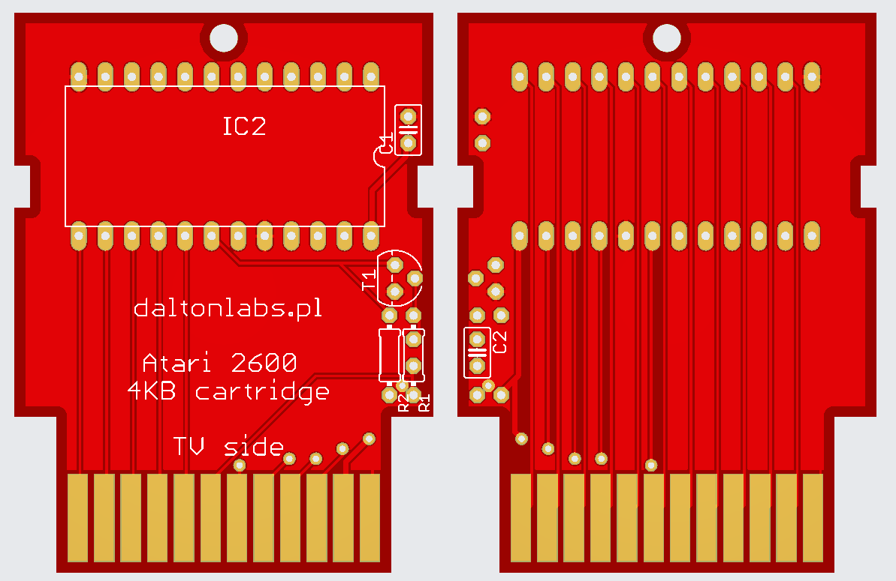

# Kartridż 4KB dla Atari 2600

W niniejszym folderze znajduje się projekt kartridża dla Atari 2600. Kartridż pomieści 4 kilobajty danych i stworzony był z myślą o grze "Berta i motyle", która jest właśnie grą 4-kilobajtową, ale zadziała na nim dowolna gra o tej wielkości.

Pliki projektu można otworzyć w programie Eagle. Gerbery, do samodzielnego zamówienia płytek drukowanych znajdują się tutaj: [gerbery](https://github.com/vandalton/BertaAndButterflies/releases).

## Pomysł

Istnieje wiele projektów płytek drukowanych kartridży dla Atari 2600. Chyba najbardziej znane są te: [https://grandideastudio.com/portfolio/gaming/pixels-past/](https://grandideastudio.com/portfolio/gaming/pixels-past/). Są one bardzo dobre, niezawodne i sprawdzone w boju. Do działania wymagają układu scalonego 74LS04, czyli inwertera. Układ ten jest inwerterem sześciobramkowym, a wykorzystywana jest tylko jedna z tych bramek.

W moim projekcie zastąpiłem układ scalony inwerterem złożonym z tranzystora NPN, dwóch rezystorów i kondensatora. Koszt tych kilku elementów jest sumarycznie o połowę niższy, niż układu 74LS04. Gdy robisz jeden kartridż na własne potrzeby, to różnica nie jest odczuwalna, ale gry robisz 50 kartridży, to robi się znacząca...

## Lista części

- **IC2** - EPROM 2732
- **T1** - BC337 - tranzystor NPN (testowałem też BC548B - działa)
- **R1** - 3,3 kOhm
- **R2** - 1 kOhm
- **C1** - 100nF
- **C2** - 1nF

## Wsparcie dla projektu

Niniejszy projekt jest open-source. Możesz ściągnąć gerbery i zamówić profesjonalnie wykonane płytki drukowane u dowolnego producenta. Możesz je też zamówić w PCBWay: [https://www.pcbway.com/project/shareproject/4KB_cartridge_for_Atari_2600_4b0ce5e2.html](https://www.pcbway.com/project/shareproject/4KB_cartridge_for_Atari_2600_4b0ce5e2.html) - w tym przypadku dostanę z tego kilka groszy, co wspomoże rozwój tego bądź moich innych projektów. Dzięki!
