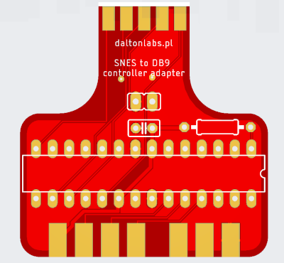

# Adapter kontrolera SNES dla Atari 2600

W niniejszym folderze znajduje się projekt adaptera umożliwiającego połączenie kontrolera od konsoli SNES do Atari 2600.

Pliki projektu można otworzyć w programie Eagle. Gerbery, do samodzielnego zamówienia płytek drukowanych znajdują się tutaj: [gerbery](https://github.com/vandalton/BertaAndButterflies/releases).

## Pomysł

Zaprojektowałem ten adapter głównie dla mojej gry - **Berta and Butterflies**. Chciałem upodobnić sterowanie do gier z serii "Game & Watch" i móc poruszyć postacią w zadany narożnik przy użyciu pojedynczego przycisku:

Jednak adapter ma także drugi tryb. Można go przełączyć wciskając równocześnie przyciski Start+Select. W tym drugim trybie adapter działa "normalnie", tzn. krzyżak odpowiada kierunkom joysticka, a przycisk "Y" działa jako fire.

## Mikroprocesor

Do wykonania projektu potrzebny jest mikroprocesor. Może to być Atmega8, Atmega48 albo Atmega88. Źródła programu dla mikroprocesora dostępne są tutaj: [snes-to-db9-controller-adapter](../../software/snes-to-db9-controller-adapter/). Przygotowane wsady binarne znajdują się tutaj: [releases](https://github.com/vandalton/BertaAndButterflies/releases).

Nie trzeba ustawiać żadnych fuse bitów - domyślne są właściwe (zegar 1MHz).

## Lista części

- **IC1** - mikroprocesor Atmega8, Atmega48 albo Atmega88
- **R1** - 10kOhm
- **C1** - 100nF
- **X1** - żeńskie złącze DB9
- **U1** - gniazdo kontrolera SNES

<!-- ## Wsparcie dla projektu

Niniejszy projekt jest open-source. Możesz ściągnąć gerbery i zamówić profesjonalnie wykonane płytki drukowane u dowolnego producenta. Możesz je też zamówić w PCBWay: [https://www.pcbway.com/project/shareproject/4KB_cartridge_for_Atari_2600_4b0ce5e2.html](https://www.pcbway.com/project/shareproject/4KB_cartridge_for_Atari_2600_4b0ce5e2.html) - w tym przypadku dostanę z tego kilka groszy, co wspomoże rozwój tego bądź moich innych projektów. Dzięki! -->
