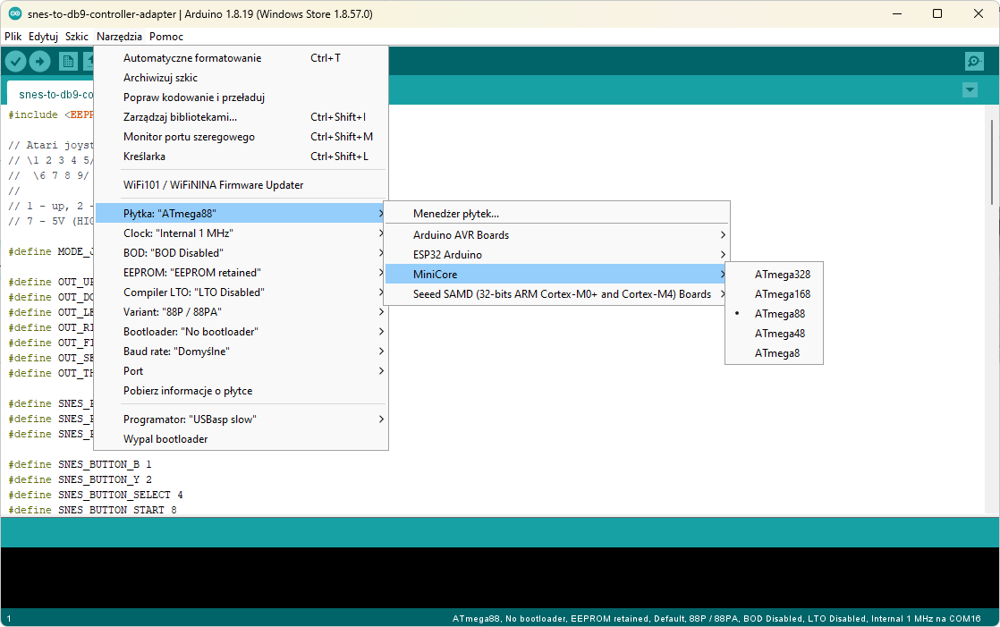

# SNES controller adapter for Atari 2600

In this folder you can find a software for an adapter that allows to connect SNES compatible controller to Atari 2600.

It is an Arduino project, but it is written for a plain Atmega8/Atmega48/Atmega88 microprocessor, not for any Arduino board.

To compile it, you need to open the sources in [Arduino IDE](https://www.arduino.cc/en/software). You'll also need to install [MiniCore](https://github.com/MCUdude/MiniCore) from [MCUdude](https://github.com/MCUdude). Then you'll be able to select Atmega as a target processor:

Precompiled binaries are available here: [releases](https://github.com/vandalton/BertaAndButterflies/releases).

## The Idea

I designed this adapter primarily for my game - **Berta and Butterflies**. I wanted to make controlling experience more similiar to the "Game & Watch" consoles and be able to move the character to any corner using only one button:

However, the adapter has also a different mode. You can switch the mode by pressing Start+Select at the same time. In this mode it will work as a normal adapter. It means that the arrow keys will work as joystick directions and "Y" button as fire.
