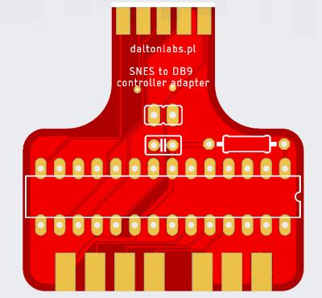
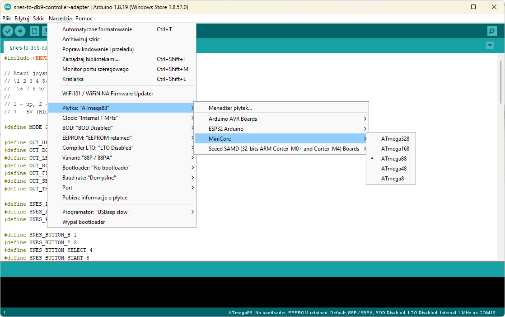
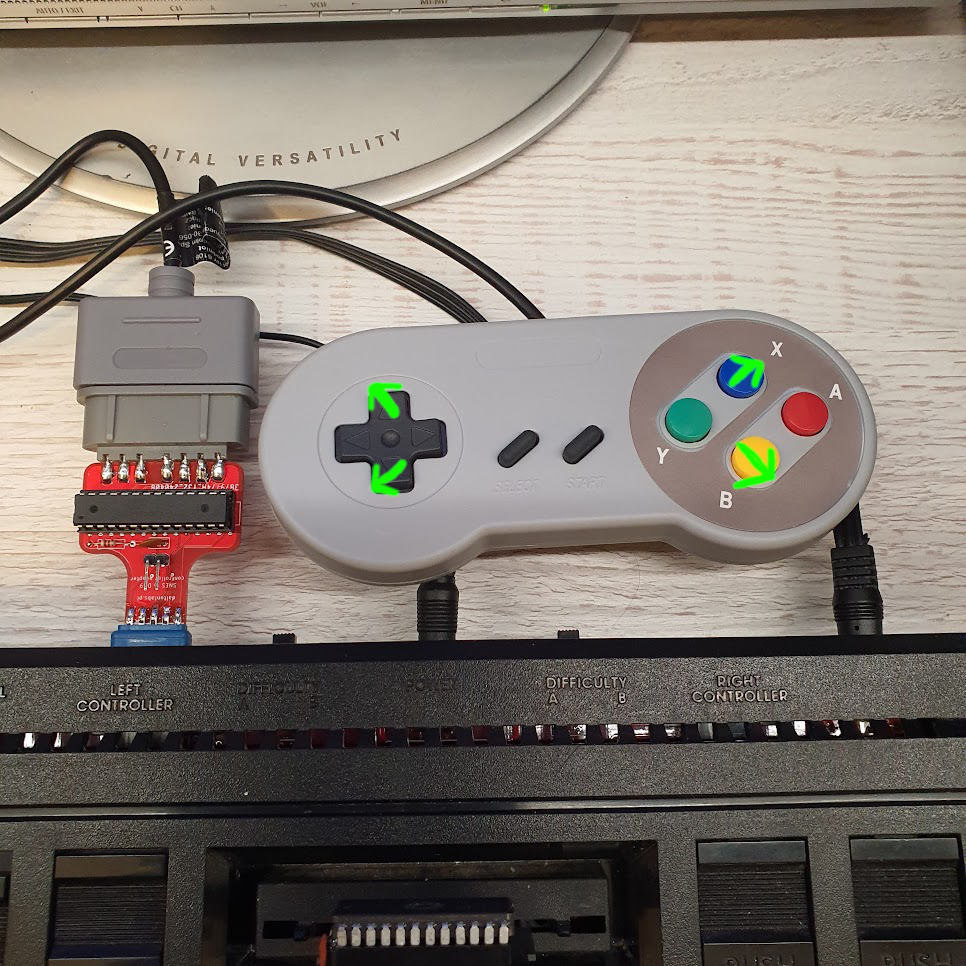

# Adapter kontrolera SNES dla Atari 2600

W niniejszym folderze znajdują się źródła oprogramowania dla adaptera umożliwiającego połączenie kontrolera od konsoli SNES do Atari 2600.

Jest to projekt napisany w Arduino, ale jest przeznaczony dla gołego procesora Atmega8/Atmega48/Atmega88, a nie dla żadnej płytki z rodziny Arduino.

Aby go samodzielnie skompilować, należy otworzyć plik źródłowy w [Arduino IDE](https://www.arduino.cc/en/software). Do tego należy zainstalować [MiniCore](https://github.com/MCUdude/MiniCore) od [MCUdude](https://github.com/MCUdude). Dopiero wówczas wybranie Atmegi jako docelowego procesora stanie się możliwe:

Skompilowany wsad w wersji binarnej znajduje się tutaj: [releases](https://github.com/vandalton/BertaAndButterflies/releases).

## Pomysł

Zaprojektowałem ten adapter głównie dla mojej gry - **Berta and Butterflies**. Chciałem upodobnić sterowanie do gier z serii "Game & Watch" i móc poruszyć postacią w zadany narożnik przy użyciu pojedynczego przycisku:

Jednak adapter ma także drugi tryb. Można go przełączyć wciskając równocześnie przyciski Start+Select. W tym drugim trybie adapter działa "normalnie", tzn. krzyżak odpowiada kierunkom joysticka, a przycisk "Y" działa jako fire.
